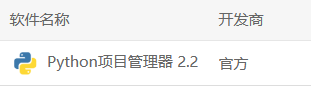
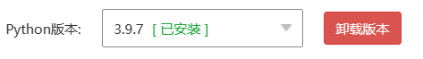
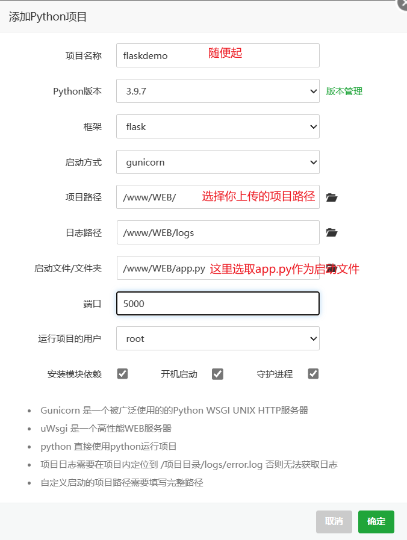
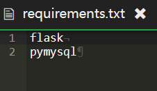
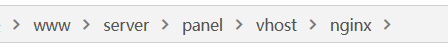

# Flask后端框架


## 项目部署

### 安装环境

先到宝塔面板上找到并且安装python的项目管理器，以及进程守护管理器




安装好之后打开python项目管理器软件，在左侧的版本管理中安装自己需要的python版本




### 部署项目

点击添加项目，按图所示进行部署（这里的前提是你已经把flask项目放到了你的自己选择的文件夹，图中所示我放到的是`/www/WEB`的文件夹当中）



值得注意的是，我们如果需要他自动帮我们装一些module的话，需要在项目文件夹里面新建一个`requirements.txt`，然后写上我们需要的模块比如这样，建议这一步在写代码的时候就新建文件一起写上。




最后添加项目成功，正常的话可以通过ip进行访问，或者你的域名绑定了服务器应该也可以直接通过http进行域名访问


### 添加ssl证书

使用的过程中，因为有时候写小程序会需要用到域名和ssl证书，这里简单介绍一下如何添加证书

#### 申请证书

这里可以在腾讯云之类的地方申请一个免费的ssl证书，拿到之后下载nginx版本的证书就好。

参考[宝塔linux配置nginx HTTPS证书和域名](https://blog.csdn.net/esuom_gib/article/details/106824618)进行操作


#### 使用nginx进行反向代理



在nginx的文件夹里新建`.conf`文件，进行配置的代理，这里我使用的是单域名多端口的分配，使用/flask路径来分发到5000端口的flask项目中，这里的`/`默认分发的是springboot的项目8080端口。

```
server{
	#端口
    listen 443 ssl;
    #域名
     ##需要修改
    server_name www.zgmzgm.top zgmzgm.top;
    #配置可以使用(www.)domain.com访问
    #server_name www.domain.com domain.com;
    
    #日志配置
    if ($time_iso8601 ~ "^(\d{4})-(\d{2})-(\d{2})") {
        set $year $1;
        set $month $2;
    }
     ##需要修改
    access_log  /www/WEB/logs/access_$year-$month.log;
    
    #证书
     ##需要修改
    ssl_certificate /www/server/panel/vhost/cert/zgmzgm.top/zgmzgm.top_bundle.pem;
    ssl_certificate_key /www/server/panel/vhost/cert/zgmzgm.top/zgmzgm.top.key;
    
    #请求超时时间
    ssl_session_timeout 5m;
    #协议
    ssl_protocols TLSv1 TLSv1.1 TLSv1.2;
    #加密算法
    ssl_ciphers ECDHE-RSA-AES128-GCM-SHA256:HIGH:!aNULL:!MD5:!RC4:!DHE;
    ssl_prefer_server_ciphers on;
    location / {
        proxy_set_header Host $host;
        proxy_set_header X-Real-IP $remote_addr;
        proxy_set_header X-Forwarded-For $proxy_add_x_forwarded_for;
         ##需要修改
        proxy_pass http://127.0.0.1:8080/;
        
    }
    
    location /flask/ {
        proxy_set_header Host $host;
        proxy_set_header X-Real-IP $remote_addr;
        proxy_set_header X-Forwarded-For $proxy_add_x_forwarded_for;
         ##需要修改
        proxy_pass http://127.0.0.1:5000/;
        
    }
}


#将http转https
server{
    listen 80;
     ##需要修改
    server_name www.zgmzgm.top zgmzgm.top;
    #配置可以使用(www.)domain.com访问
    #server_name www.domain.com domain.com;
    
     ##需要修改
    rewrite ^/(.*)$ https://www.zgmzgm.top:443/$1 permanent;
    
}
```


## 如何写接口？

参考

[Python 查询数据库数据转成json格式输出到文件](https://blog.csdn.net/huangyuqi520/article/details/103492984)


### GET请求

这里简单展示一个获取所有的示例

```python
def selectAll():
    # 连接数据库
    conn = pymysql.connect(host='42.193.160.52',  # 连接名称，默认127.0.0.1
                           user='dianxinbei',  # 用户名
                           password='A8SdsZAWMpGkKmGb',  # 密码
                           port=3306,  # 端口，默认为3306
                           db='dianxinbei',  # 数据库名称
                           charset='utf8'  # 字符编码
                           )

    cur = conn.cursor()  # 生成游标对象
    sql = "select * from team"
    try:
        cur.execute(sql)
        data = cur.fetchall()

        cur.close()  # 关闭游 p标
        conn.close()  # 关闭连接
        jsonData = []
        for row in data:
            result = {}
            result['stu1_id'] = row[0]
            result['stu2_id'] = row[1]
            result['stu3_id'] = row[2]
            result['stu1_name'] = row[3]
            result['stu2_name'] = row[4]
            result['stu3_name'] = row[5]
            result['stu1_phone'] = row[6]
            result['team_title'] = row[7]
            result['team_name'] = row[8]
            result['team_school'] = row[9]
            result['team_id'] = row[10]
            result['team_score'] = row[11]
            jsonData.append(result)
    except Exception as e:
        cur.close()  # 关闭游标
        conn.close()  # 关闭连接
        print('error')
    else:
        return jsonData
```

```python
@app.route('/teams', methods=['get'])
def selectAll():
    result = {'status': 200, 'data': dao.selectAll()}
    jsonResult = json.dumps(result)
    return Response(jsonResult, mimetype='application/json')  #声明Content-Type为json格式
```


### POST请求

DAO层代码

使用%占位符可以做到**防注入**

```python
# 添加队伍
def addTeam(team):
    conn = pymysql.connect(host='42.193.160.52',  # 连接名称，默认127.0.0.1
                           user='dianxinbei',  # 用户名
                           password='A8SdsZAWMpGkKmGb',  # 密码
                           port=3306,  # 端口，默认为3306
                           db='dianxinbei',  # 数据库名称
                           charset='utf8'  # 字符编码
                           )

    cur = conn.cursor()  # 生成游标对象
    sql = "Replace team (team_name,team_school,team_title,stu1_id,stu1_name,stu1_phone,stu2_id,stu2_name,stu3_id," \
          "stu3_name) value (%(team_name)s,%(team_school)s,%(team_title)s,%(stu1_id)s,%(stu1_name)s,%(stu1_phone)s," \
          "%(stu2_id)s,%(stu2_name)s,%(stu3_id)s,%(stu3_name)s)"
    try:
        cur.execute(sql, team)
        conn.commit()
        cur.close()  # 关闭游标
        conn.close()  # 关闭连接

        return 1
    except Exception as e:
        conn.rollback()
        cur.close()  # 关闭游标
        conn.close()  # 关闭连接
        print('error')
        return 0
```

controller层代码（写在app.py就行）

```python
@app.route('/teams', methods=['GET', 'POST'])
def selectAll():
    global result, jsonResult
    #处理get请求
    if request.method == 'GET':
        result = {'status': 200, 'data': dao.selectAll()}
        jsonResult = json.dumps(result)
        return Response(jsonResult, mimetype='application/json')  # 声明请求头Content-Type为json格式
    #处理post请求
    elif request.method == 'POST':
        try:
            result = {'status': 200}
            data = request.get_json()
            dao.addTeam(data)
            jsonResult = json.dumps(result)
            return Response(jsonResult, mimetype='application/json')
        except:
            result['status'] = 400
            return Response(jsonResult, mimetype='application/json')
```


## axios层获取数据

参考上面的两个get和post请求，分别对应的axios层的js代码如下（注意是在vue.js框架里使用的）

```javascript
//添加队伍数据
          addTeam() {
            alert("提交成功")
            //发送请求数据
            axios.post("/teams",this.tableData).then((res) => {
            });
            //测试使用
          },
```

```javascript
//获取表单数据
          getAll() {
            axios.get("/teams").then((res) => {
              this.tableData = res.data.data;
              console.log(res.data);
            });
          },
```


