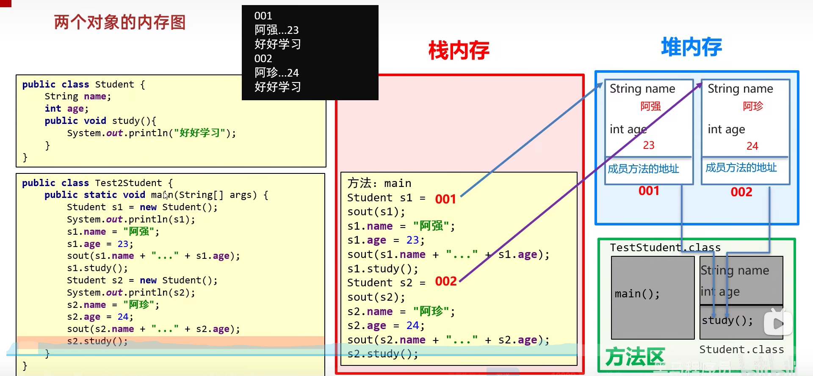

# Java学习


## 前言

由于之前学过别的语言，所以在这里记录一些不一样，或者有趣的东西。


## 环境变量

### cmd窗口面板操作

win+R打开输入cmd即可进入cmd的面板


### 配置环境变量

在高级设置里面的path里面可以配置环境变量

可以让cmd上在任何文件夹里面输入该文件都能找到


## 键盘录入

scanner


## 方法

可以理解为函数，但是方法一般是在类里面新建的

通常使用的是

```java
public static void 函数名字(){
    //方法内容
}
```

可以说，方法就是在类中定义的函数，他能够重载


## 类

类名的首字母建议大写，见名知义，驼峰命名。

java的类有多种，其中有

javaBean类，java测试类（里面包括main方法）


### 对象

在写函数和对象的时候，需要加上public或者private来声明他的格式


### 构造函数

和c++中一样，但是注意最好每次都写上无参构造函数，规范


### 标准的javabean类

所有成员变量private

无参构造以及所有变量的构造函数写好

getter and setter

一些其他的操作


快捷键可以利用ctrl+insert进行操作或者右键generate

或者使用插件ptg快速生成


### 类的内存图

参考[对象内存图](https://www.bilibili.com/video/BV17F411T7Ao/?p=87&spm_id_from=pageDriver&vd_source=0eab86b58f0ee8a55b25e7648743b65a)

理解栈，堆，方法区之间的关系

（在new一个对象的时候，实际是在堆里面开辟了内存空间）




## 输出

### sout

简单的控制台输出


### souf

可以类比为C++中的prinf

利用%s进行占位


## tips

①按住鼠标滚轮拖拽可以实现竖排的选择

②ctrl+alt+L 格式化代码

③ctrl+d向下赋值一行

④ctrl+r实现搜索替换

