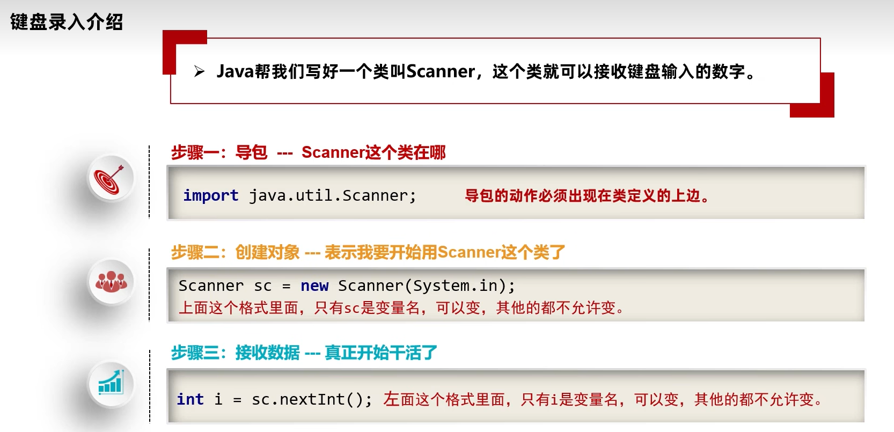

# Java学习


## 前言

由于之前学过别的语言，所以在这里记录一些不一样，或者有趣的东西。


## 环境变量

### cmd窗口面板操作

win+R打开输入cmd即可进入cmd的面板


### 配置环境变量

在高级设置里面的path里面可以配置环境变量

可以让cmd上在任何文件夹里面输入该文件都能找到


## 键盘录入

scanner




## 方法

可以理解为函数，但是方法一般是在类里面新建的

通常使用的是

```java
public static void 函数名字(){
    //方法内容
}
```

可以说，方法就是在类中定义的函数，他能够重载


## 类

类名的首字母建议大写，见名知义，驼峰命名。

java的类有多种，其中有

javabean类，java测试类（里面包括main方法）


## tips

①按住鼠标滚轮拖拽可以实现竖排的选择

②ctrl+alt+L 格式化代码

