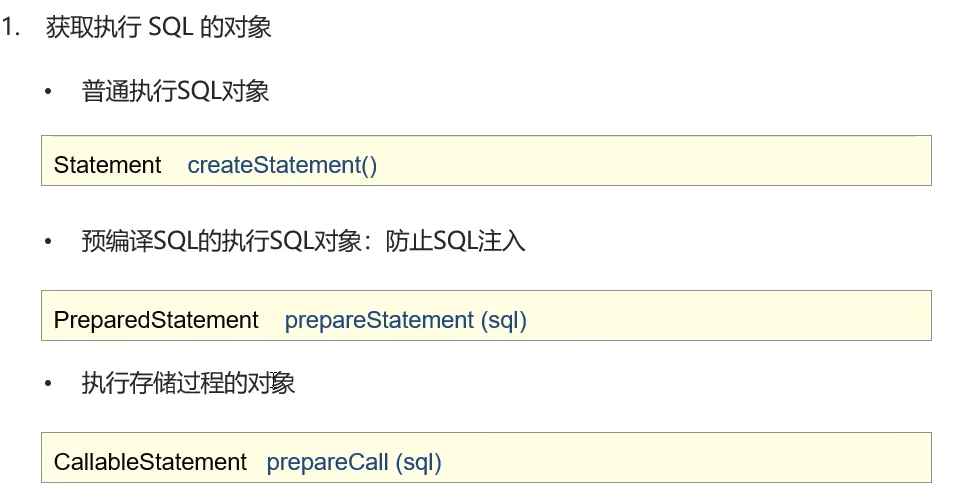
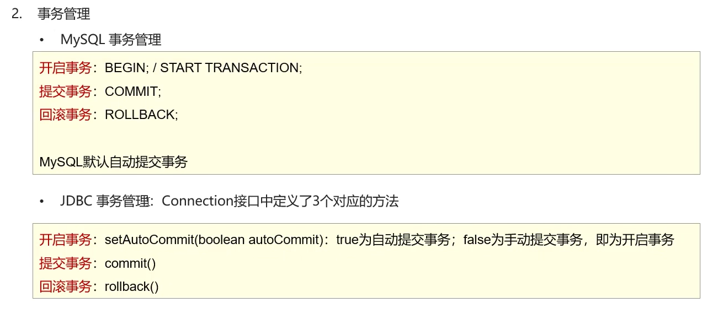
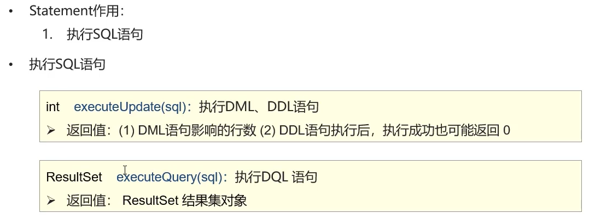
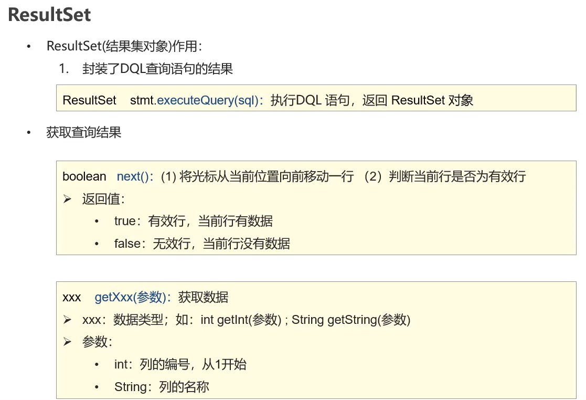
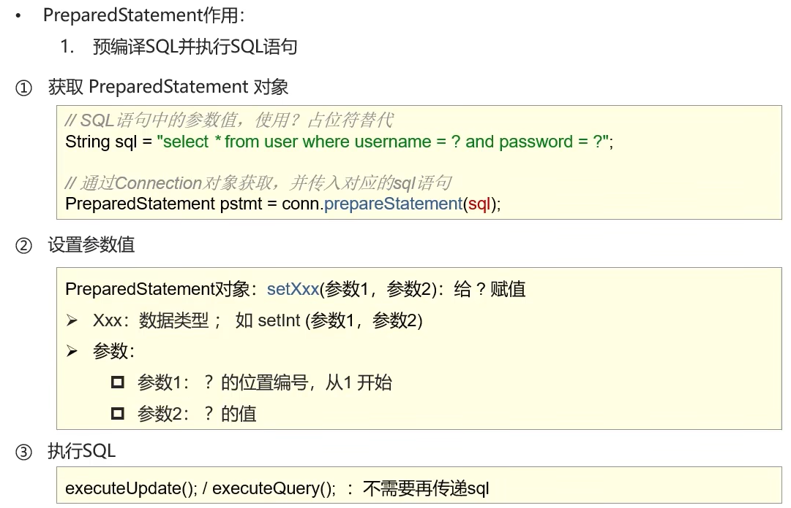

# javaweb


## JDBC

用java语言操作关系型数据库的一套API，全称（java database connectitvity）java数据库连接

在java里面使用数据库，需要导入对应数据库的包，这里使用的数据库式mysql

一般步骤如下

在此之前，需要导入java的mysql包

```java
/**
 * JDBC的快速入门
 */
public class JDBCDemo {
    public static void main(String[] args) throws Exception {
        //1.注册驱动，一般是不写的
        Class.forName("com.mysql.cj.jdbc.Driver");

        //2.获取链接
        String url="jdbc:mysql://localhost:3306/jdbcdemo";
        String user="koliko";
        String password="abc123456";
        Connection conn = DriverManager.getConnection(url, user, password);

        //3.定义sql语句
        String sql="INSERT into student (stu_id,stu_class,stu_name ) VALUES (5,3,\"zgm\")";

        //4.获取sql的执行对象
        Statement stmt = conn.createStatement();

        //5.执行对象
        int count = stmt.executeUpdate(sql);//返回的结果是行数

        //6.处理结果
        System.out.println(count);

        //7.释放资源
        stmt.close();
        conn.close();
    }
}
```


### DriverManger

（驱动管理类）作用：

1. 注册驱动
2. 获取数据库的连接


### Connection

(数据库连接对象)作用：

1. 获取sql的对象

   

2. 管理事务

   

在事务处理的时候，通常使用java里的try catch语句，在抛出异常后进行回滚，无异常则提交，以达到事务的完成。


### Statement

被用来执行sql语句




### ResultSet



ResultSet属于数据格式

代码参考如下，利用集合来实现对数据库行内容的提取

```java
public class JDBC_ResultSet {
    public static void main(String[] args) throws Exception {
        //1.注册驱动
        //Class.forName("com.mysql.cj.jdbc.Driver");

        //2.获取链接
        String url="jdbc:mysql://localhost:3306/jdbcdemo";
        String user="koliko";
        String password="abc123456";
        Connection conn = DriverManager.getConnection(url, user, password);

        //3.定义sql语句
        String sql="select * from student";

        //4.获取sql的执行对象
        Statement stmt = conn.createStatement();

        //5.执行对象
        ResultSet rs=stmt.executeQuery(sql);//返回的结果是ResultSet格式的对象

        List<student> list=new ArrayList<>();
        //6.处理结果
     	//当rs.next()指向为非空的时候不断地赋值
        while(rs.next()){
            student stu=new student();

            int stu_id=rs.getInt("stu_id");
            String stu_name=rs.getString("stu_name");
            String stu_class=rs.getString("stu_class");

            stu.setStu_id(stu_id);
            stu.setStu_name(stu_name);
            stu.setStu_class(stu_class);

            list.add(stu);
        }

        System.out.println(list);
        //7.释放资源
        rs.close();
        stmt.close();
        conn.close();
    }
}
```


### PrepareStatement

作用和Statement一样，能做到sql防注入

防注入的原理在于，在输入字符串的时候进行了转义



在这里预编译功能需要自己打开

```
String sql = "jdbc:mysql://localhost/db ? userServerPreStatement=ture";
```

使用实例

```java
public class preStatement {
    public static void main(String[] args) throws Exception {
        //1.注册驱动
        //Class.forName("com.mysql.cj.jdbc.Driver");

        //2.获取链接
        String url="jdbc:mysql://localhost:3306/jdbcdemo?useServerPreStatement=ture";
        String user="koliko";
        String password="abc123456";
        Connection conn = DriverManager.getConnection(url, user, password);

        //3.定义sql语句
        String sql="select * from student where stu_id=?";

        //4.获取pstmt对象
        PreparedStatement pstmt = conn.prepareStatement(sql);

        //5.设置？的值
        pstmt.setInt(1,3);

        //6.执行sql
        ResultSet rs = pstmt.executeQuery();

        //7.获取结果
        List<student> list = new ArrayList<>();
        while(rs.next()){
            student stu = new student();
            stu.setStu_id(rs.getInt("stu_id"));
            stu.setStu_name(rs.getString("stu_name"));
            stu.setStu_class(rs.getString("stu_class"));

            list.add(stu);
        }

        //8.输出结果
        System.out.println(list);

        //9.释放资源
        rs.close();
        pstmt.close();
        conn.close();
    }
}
```


### Druid（数据库连接池）

用来管理用户的数据库连接（参考服务员与顾客的关系）

```java
@Test
public void DruidTest() throws Exception {
    //1.导入jar包
    //2.定义.properties配置文件
    //3.加载配置文件
    Properties prop = new Properties();
    prop.load(Files.newInputStream(Paths.get("JDBC/src/druid.properties")));

    //4.获取连接对象
    DataSource dataSource = DruidDataSourceFactory.createDataSource(prop);

    //5.获取数据库的连接
    Connection conn = dataSource.getConnection();

    System.out.println(conn);
}
```


## Maven

统一IDE的结构，管理依赖，还有项目编译，测试，清除等功能

安装的时候注意修改阿里云镜像加快下载速度，有需要自己修改仓库位置

### 在IDEA中使用Maven

在设置里面搜索Maven修改路径即可。


## MyBatis

一款优秀的**持久层框架**，用于**简化JDBC的开发**

> 持久层：负责将数据保存到数据库的那层代码

具体的代码和操作流程参考官方网站[MyBatis中文网](https://mybatis.net.cn/)


### 添加依赖

```xml
<dependency>
    <groupId>org.mybatis</groupId>
    <artifactId>mybatis</artifactId>
    <version>3.5.11</version>
</dependency>

<dependency>
    <groupId>mysql</groupId>
    <artifactId>mysql-connector-java</artifactId>
    <version>8.0.30</version>
</dependency>

<dependency>
    <groupId>junit</groupId>
    <artifactId>junit</artifactId>
    <version>4.13.2</version>
    <scope>test</scope>
</dependency>

<dependency>
    <groupId>org.slf4j</groupId>
    <artifactId>slf4j-api</artifactId>
    <version>2.0.5</version>
</dependency>

<dependency>
    <groupId>ch.qos.logback</groupId>
    <artifactId>logback-classic</artifactId>
    <version>1.4.5</version>
</dependency>

<dependency>
    <groupId>ch.qos.logback</groupId>
    <artifactId>logback-core</artifactId>
    <version>1.4.5</version>
</dependency>
```


### 代码演示

```java
public class MyBatisDemo {
    public static void main(String[] args) throws IOException {
        //1.加载核心配置文件，获取 SqlSessionFactory
        String resource = "mybatis-config.xml";
        InputStream inputStream = Resources.getResourceAsStream(resource);
        SqlSessionFactory sqlSessionFactory = new SqlSessionFactoryBuilder().build(inputStream);

        //2.获取SqlSessionFactory对象，用它来执行sql
        SqlSession sqlSession = sqlSessionFactory.openSession();

        //3.执行sql
        List<User> users = sqlSession.selectList("selectAll");

        System.out.println(users);

        //4.释放资源
        sqlSession.close();
    }
}
```

