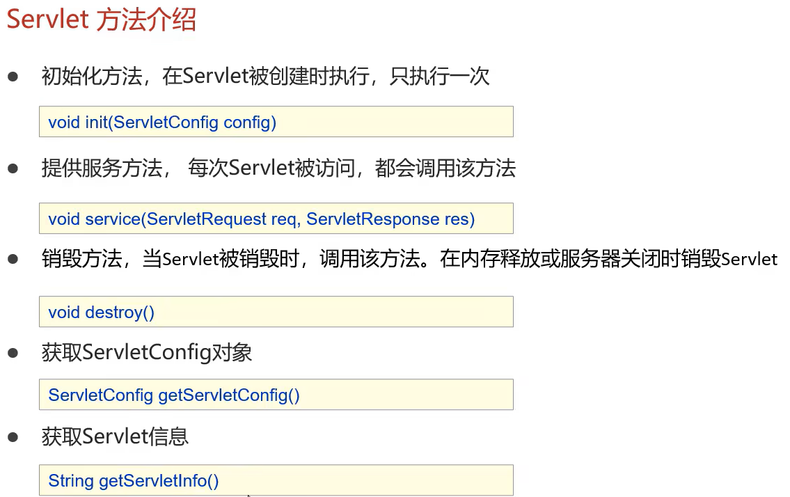
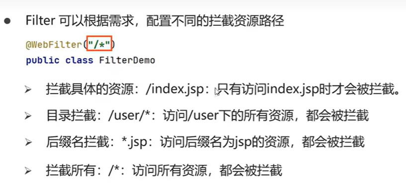
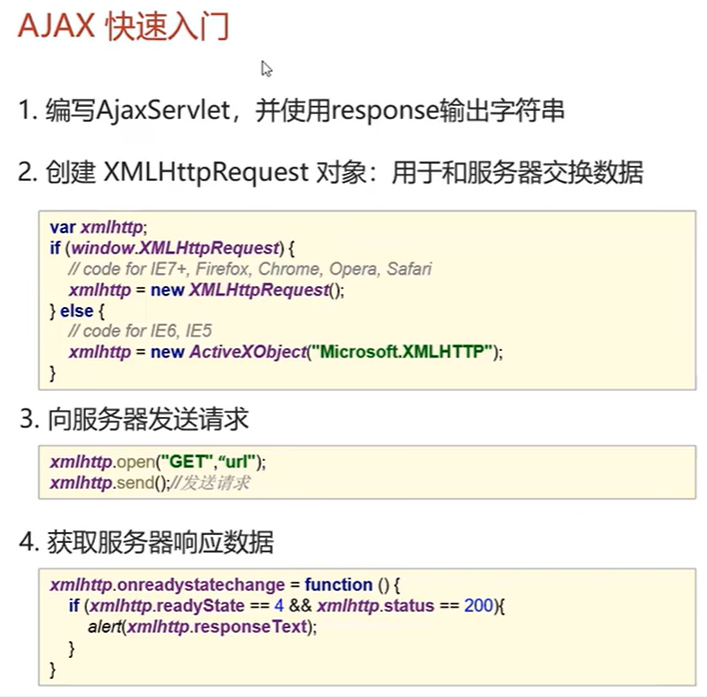

# javaweb


## JDBC

用java语言操作关系型数据库的一套API，全称（java database connectitvity）java数据库连接

在java里面使用数据库，需要导入对应数据库的包，这里使用的数据库式mysql

一般步骤如下

在此之前，需要导入java的mysql包

```java
/**
 * JDBC的快速入门
 */
public class JDBCDemo {
    public static void main(String[] args) throws Exception {
        //1.注册驱动，一般是不写的
        Class.forName("com.mysql.cj.jdbc.Driver");

        //2.获取链接
        String url="jdbc:mysql://localhost:3306/jdbcdemo";
        String user="koliko";
        String password="abc123456";
        Connection conn = DriverManager.getConnection(url, user, password);

        //3.定义sql语句
        String sql="INSERT into student (stu_id,stu_class,stu_name ) VALUES (5,3,\"zgm\")";

        //4.获取sql的执行对象
        Statement stmt = conn.createStatement();

        //5.执行对象
        int count = stmt.executeUpdate(sql);//返回的结果是行数

        //6.处理结果
        System.out.println(count);

        //7.释放资源
        stmt.close();
        conn.close();
    }
}
```


### DriverManger

（驱动管理类）作用：

1. 注册驱动
2. 获取数据库的连接


### Connection

(数据库连接对象)作用：

1. 获取sql的对象

   

2. 管理事务

   

在事务处理的时候，通常使用java里的try catch语句，在抛出异常后进行回滚，无异常则提交，以达到事务的完成。


### Statement

被用来执行sql语句


### ResultSet


ResultSet属于数据格式

代码参考如下，利用集合来实现对数据库行内容的提取

```java
public class JDBC_ResultSet {
    public static void main(String[] args) throws Exception {
        //1.注册驱动
        //Class.forName("com.mysql.cj.jdbc.Driver");

        //2.获取链接
        String url="jdbc:mysql://localhost:3306/jdbcdemo";
        String user="koliko";
        String password="abc123456";
        Connection conn = DriverManager.getConnection(url, user, password);

        //3.定义sql语句
        String sql="select * from student";

        //4.获取sql的执行对象
        Statement stmt = conn.createStatement();

        //5.执行对象
        ResultSet rs=stmt.executeQuery(sql);//返回的结果是ResultSet格式的对象

        List<student> list=new ArrayList<>();
        //6.处理结果
     	//当rs.next()指向为非空的时候不断地赋值
        while(rs.next()){
            student stu=new student();

            int stu_id=rs.getInt("stu_id");
            String stu_name=rs.getString("stu_name");
            String stu_class=rs.getString("stu_class");

            stu.setStu_id(stu_id);
            stu.setStu_name(stu_name);
            stu.setStu_class(stu_class);

            list.add(stu);
        }

        System.out.println(list);
        //7.释放资源
        rs.close();
        stmt.close();
        conn.close();
    }
}
```


### PrepareStatement

作用和Statement一样，能做到sql防注入

防注入的原理在于，在输入字符串的时候进行了转义


在这里预编译功能需要自己打开

```
String sql = "jdbc:mysql://localhost/db ? userServerPreStatement=ture";
```

使用实例

```java
public class preStatement {
    public static void main(String[] args) throws Exception {
        //1.注册驱动
        //Class.forName("com.mysql.cj.jdbc.Driver");

        //2.获取链接
        String url="jdbc:mysql://localhost:3306/jdbcdemo?useServerPreStatement=ture";
        String user="koliko";
        String password="abc123456";
        Connection conn = DriverManager.getConnection(url, user, password);

        //3.定义sql语句
        String sql="select * from student where stu_id=?";

        //4.获取pstmt对象
        PreparedStatement pstmt = conn.prepareStatement(sql);

        //5.设置？的值
        pstmt.setInt(1,3);

        //6.执行sql
        ResultSet rs = pstmt.executeQuery();

        //7.获取结果
        List<student> list = new ArrayList<>();
        while(rs.next()){
            student stu = new student();
            stu.setStu_id(rs.getInt("stu_id"));
            stu.setStu_name(rs.getString("stu_name"));
            stu.setStu_class(rs.getString("stu_class"));

            list.add(stu);
        }

        //8.输出结果
        System.out.println(list);

        //9.释放资源
        rs.close();
        pstmt.close();
        conn.close();
    }
}
```


### Druid（数据库连接池）

用来管理用户的数据库连接（参考服务员与顾客的关系）

```java
@Test
public void DruidTest() throws Exception {
    //1.导入jar包
    //2.定义.properties配置文件
    //3.加载配置文件
    Properties prop = new Properties();
    prop.load(Files.newInputStream(Paths.get("JDBC/src/druid.properties")));

    //4.获取连接对象
    DataSource dataSource = DruidDataSourceFactory.createDataSource(prop);

    //5.获取数据库的连接
    Connection conn = dataSource.getConnection();

    System.out.println(conn);
}
```


## Maven

统一IDE的结构，管理依赖，还有项目编译，测试，清除等功能

安装的时候注意修改阿里云镜像加快下载速度，有需要自己修改仓库位置

### 在IDEA中使用Maven

在设置里面搜索Maven修改路径即可。


## MyBatis

一款优秀的**持久层框架**，用于**简化JDBC的开发**

> 持久层：负责将数据保存到数据库的那层代码

具体的代码和操作流程参考官方网站[MyBatis中文网](https://mybatis.net.cn/)


### 添加依赖

```xml
<dependency>
    <groupId>org.mybatis</groupId>
    <artifactId>mybatis</artifactId>
    <version>3.5.11</version>
</dependency>

<dependency>
    <groupId>mysql</groupId>
    <artifactId>mysql-connector-java</artifactId>
    <version>8.0.30</version>
</dependency>

<dependency>
    <groupId>junit</groupId>
    <artifactId>junit</artifactId>
    <version>4.13.2</version>
    <scope>test</scope>
</dependency>

<dependency>
    <groupId>org.slf4j</groupId>
    <artifactId>slf4j-api</artifactId>
    <version>2.0.5</version>
</dependency>

<dependency>
    <groupId>ch.qos.logback</groupId>
    <artifactId>logback-classic</artifactId>
    <version>1.4.5</version>
</dependency>

<dependency>
    <groupId>ch.qos.logback</groupId>
    <artifactId>logback-core</artifactId>
    <version>1.4.5</version>
</dependency>
```


### 代码演示

```java
public class MyBatisDemo {
    public static void main(String[] args) throws IOException {
        //1.加载核心配置文件，获取 SqlSessionFactory
        String resource = "mybatis-config.xml";
        InputStream inputStream = Resources.getResourceAsStream(resource);
        SqlSessionFactory sqlSessionFactory = new SqlSessionFactoryBuilder().build(inputStream);

        //2.获取SqlSessionFactory对象，用它来执行sql
        SqlSession sqlSession = sqlSessionFactory.openSession();

        //3.执行sql
        List<User> users = sqlSession.selectList("selectAll");

        System.out.println(users);

        //4.释放资源
        sqlSession.close();
    }
}
```


### Mapper代理开发

可以解决硬编码问题，更加安全且可以使用代码补全更加方便

重点

1. mapper的xml文件和同名的interface文件放**在同一个目录下**

2. 可以采用包扫描的方式获取mapper`<package name="top/zgmzgm/mapper"/>`

3. 在interface接口文件下映射`List<User> selectAll();`这里需要注意返回的格式

4. 执行sql语句换成

   ```java
    //3.执行sql
           //获取userMapper接口的代理对象
           UserMapper userMapper = sqlSession.getMapper(UserMapper.class);
           List<User> users = userMapper.selectAll();
   
           System.out.println(users);
   ```


### MyBatis的核心文件配置

xml文件中配置

#### `<environments>`配置数据库的连接环境信息

可以放多个数据库并且进行切换

在下面的default中修改id的名字即可切换数据库

```xml
<environments default="development">
        <environment id="development">
            <transactionManager type="JDBC"/>
            <dataSource type="POOLED">
                <!--数据库连接信息-->
                <property name="driver" value="com.mysql.cj.jdbc.Driver"/>
                <property name="url" value="jdbc:mysql://localhost/jdbcdemo?serverTimezone=Asia/Shanghai"/>
                <property name="username" value="koliko"/>
                <property name="password" value="abc123456"/>
            </dataSource>
        </environment>

        <environment id="test">
            <transactionManager type="JDBC"/>
            <dataSource type="POOLED">
                <!--数据库连接信息-->
                <property name="driver" value="com.mysql.cj.jdbc.Driver"/>
                <property name="url" value="jdbc:mysql://localhost/jdbcdemo?serverTimezone=Asia/Shanghai"/>
                <property name="username" value="root"/>
                <property name="password" value="123456"/>
            </dataSource>
        </environment>
    </environments>
```


### `<typeAliases>`简化pojo路径

引入pojo的文件地址

```xml
<typeAliases>
        <package name="top.zgmzgm.pojo"/>
</typeAliases>
```

在mapper文件里面写返回的类不需要包含路径

```xml
<!--之前-->
<mapper namespace="top.zgmzgm.mapper.UserMapper">
    <select id="selectAll" resultType="top.zgmzgm.pojo.User">
        select * from student;
    </select>
</mapper>

<!--之后-->
<mapper namespace="top.zgmzgm.mapper.UserMapper">
    <select id="selectAll" resultType="User">
        select * from student;
    </select>
</mapper>
```


### resultMap结果映射

在mapper的xml文件中如果数据库和Bean的命名不同，需要做映射

插入如下代码

```xml
	<resultMap id="userResultMap" type="User">
        <!--id完成主键映射，result完成普通映射-->
        <id column="stu_id" property="stuId"/>
        <result column="stu_name" property="stuName"/>
        <result column="stu_class" property="stuClass"/>
    </resultMap>
    
    <select id="selectAll" resultMap="userResultMap">
        select *
        from student;
    </select>
```

在xml中如果遇到特殊字符会报错，比如小于号

解决方法

1. 使用转移字符，`<`的转移字符`&lt;`
2. CDATA区


### 动态sql

在多条件查询等问题下，可能需要用到一些逻辑语句MyBatis提供了动态查询的东西

#### if标签+where标签

```xml
	<!--多条件查询-->
    <select id="selectByCondition" resultMap="userResultMap">
        select * from student
        <where>
            <if test="stuId!=null">
                and stu_id=#{stuId}
            </if>
            <if test="stuName!=null">
                and stu_name=#{stuName}
            </if>
            <if test="stuClass!=null">
                and stu_class=#{stuClass}
            </if>
        </where>
    </select>
```


#### choose标签和when/otherwise标签

相当于switch


### set标签

一般使用于动态修改


### foreach标签

通常用来进行批量操作，不知道要填几个占位符的情况

```xml
	<delete id="delByStuIds">
        delete from student where stu_id in
        <foreach collection="Ids" item="id" separator="," open="(" close=")">
            #{id}
        </foreach>;
    </delete>
```


### 使用注解开发


可以完成简单的增删改查

### sqlSessionFactory

这个只能创建一次，考虑到数据库连接池的资源消耗

静态代码块实现

在utils文件夹里创建SqlSessionFactoryUtils类

```java
public class SqlSessionUtils {

    private static SqlSessionFactory sqlSessionFactory;

    static {
        //静态代码块会随着类的加载而自动执行，且执行一次

        try {
            String resource = "mybatis-config.xml";
            InputStream inputStream = Resources.getResourceAsStream(resource);
            sqlSessionFactory = new SqlSessionFactoryBuilder().build(inputStream);
        } catch (IOException e) {
            throw new RuntimeException(e);
        }
    }

    public static SqlSessionFactory getSqlSessionFactory() {
        return sqlSessionFactory;
    }

}
```


## http协议

### http请求数据格式


## Servlet

### 基本操作


### maven依赖

记得要写scope

```xml
<dependency>
  <groupId>javax.servlet</groupId>
  <artifactId>javax.servlet-api</artifactId>
  <version>4.0.1</version>
  <scope>provided</scope>
</dependency>
```


### 主要流程

通过implements实现

```java
@WebServlet("/demo1")
public class ServletDemo1 implements Servlet {

    @Override
    public void init(ServletConfig servletConfig) throws ServletException {

    }

    @Override
    public ServletConfig getServletConfig() {
        return null;
    }

    @Override
    public void service(ServletRequest servletRequest, ServletResponse servletResponse) throws ServletException, IOException {
        System.out.println("hello world");
    }

    @Override
    public String getServletInfo() {
        return null;
    }

    @Override
    public void destroy() {

    }
}
```

但是在使用时一般会通过继承httpServlet的方式来实现，通过重写doget和dopost来实现

```java
@WebServlet(urlPatterns = "/demo2")
public class ServletDemo2 extends HttpServlet {
    @Override
    protected void doGet(HttpServletRequest req, HttpServletResponse resp) throws ServletException, IOException {
        System.out.println("get...");
    }

    @Override
    protected void doPost(HttpServletRequest req, HttpServletResponse resp) throws ServletException, IOException {
        System.out.println("post...");
    }
}
```


### 一些方法介绍




### urlPattern的配置


可以直接新建一个Servlet的文件


### Request&Response

请求和响应数据

可以进行请求转发

doget和dopost选一个使用即可，解决乱码问题

```java
req.setCharacterEncoding("UTF-8");
```


1. 资源重定向

   ```java
   resp.sendRedirect("/CheckNull.html");
   ```

2. 请求转发

   ```java
   req.setAttribute("team",team);
   //处理跳转链接
   req.getRequestDispatcher("/Check.jsp").forward(req, resp);
   ```


## JSP

在jsp页面中可以写html也可以写java


对于JSP的代码，我的评价是：别用


## MVC模式


#### ssm框架


## 会话

### cookie-客户端

#### 基本使用


### session-服务端

#### 基本使用


## Filter

过滤器，JavaWeb的三大组件之一

可以把对资源的请求拦截下来

可以完成通用的而操作（只执行一次）

要注意拦截过程不要把css也给拦截下来了


### 快速入门


### 实例代码

```java
@WebFilter("/*")
public class FilterDemo implements Filter {
    @Override
    public void init(FilterConfig filterConfig) throws ServletException {

    }

    @Override
    public void doFilter(ServletRequest servletRequest, ServletResponse servletResponse, FilterChain filterChain) throws IOException, ServletException {
        System.out.println("Filter...");

        //放行
        filterChain.doFilter(servletRequest,servletResponse);
    }

    @Override
    public void destroy() {

    }
}
```


### 路径配置




### 过滤器链

就是多个过滤器使用，值得注意的是过滤器的先后顺序按照过滤器的名字排序决定


## Listener

监听器，同样为javaweb的三大组件之一


## AJAX

全称 Asynchrounous JavaScript And Xml (异步的 JavaScript 和 xml )

实现前后端分离，同步校验，与服务器进行数据交换 

<script src="https://cdn.jsdelivr.net/npm/axios/dist/axios.min.js"></script>



在w3cschool可以获取上述的代码


### Axios异步框架


### JSON

使用转换json格式可以添加依赖

```xml
<dependency>
  <groupId>com.alibaba</groupId>
  <artifactId>fastjson</artifactId>
  <version>2.0.22</version>
</dependency>
```


#### 使用实例

```javascript

    window.onload = function () {
        //发送ajax请求
        axios({
            method: "get",
            ur l: "http://localhost:8080/ajaxDemo_war/selectAllServlet"
        }).then(function (resp) {
            let tableData="<tr align=\"center\">\n" +
                "        <td>序号</td>\n" +
                "        <td>姓名</td>\n" +
                "        <td>密码</td>\n" +
                "    </tr>"

            //获取数据
            let users = resp.data;
            for (let i = 0; i < users.length; i++) {
                let user=users[i];
                tableData+="\n"+
                    "<tr align=\"center\">\n" +
                    "        <td>"+(i+1)+"</td>\n" +
                    "        <td>"+user.userName+"</td>\n" +
                    "        <td>"+user.userPassword+"</td>\n" +
                    "</tr>"
            }

            document.getElementById("userTable").innerHTML=tableData;
        })
    }

```

在使用onclick获取页面信息传递过来的json数据的时候不能用getpara..了，可以这样使用来解析json数据


## Vue

一套前端框架，免除原生JavaScript中的DOM操作，简化书写

<script src="https://cdn.jsdelivr.net/npm/vue@2.7.14/dist/vue.js"></script>


## 注意事项

1. 在使用的时候，发现mapper文件使用不了包扫描的操作，会出现500报错且提示resultmap的错误，这里建议直接选择全部路径
1. `-Djava.security.egd=file:/dev/urandom ` 解决tomcat慢的问题


