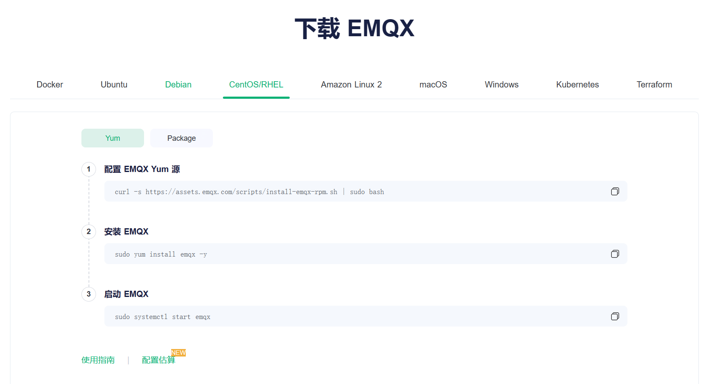
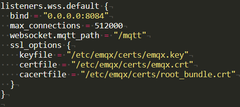
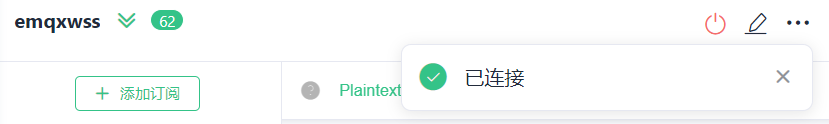

# 搭建基于emqx的mqtt服务器

参考链接：

[在云服务器上安装emqx+wss并使用ESP32连接 ](https://yuanze.wang/posts/emqx-wss-esp32/#测试服务器)

[物联网学习笔记3：在阿里云上部署EMQ及配置wss连接mqtt](https://blog.csdn.net/weixin_43440746/article/details/103791278)


## 安装emqx

这里使用官网上的yum步骤进行下载（我的系统为centos7）





## 操作emqx

安装完成之后我们使用`sudo systemctl start emqx`启动一下emqx

使用yum安装的指令可以这样子

```
sudo systemctl start emqx
sudo systemctl stop emqx
sudo systemctl restart emqx
```


安装完成之后可以进入服务器的18083端口对mqtt服务器进行一下设置修改之类的（这里就不详细说明了）

测试下mqtt连接，可以看到连接成功了


## 开启wss

emqx在安装好之后默认可以使用ws，如果你希望和小程序进行联动的话需要使用wss连接才能用，而想要开启wss的websocket服务的话则需要添加ca证书等文件才可以启用（之前也是一直卡在这里导致一直开启不了）


在这里我使用的是腾讯云申请的ssl证书，找到证书的路径之后，下载免费的ssl证书(具体的申请方法可以参考网上流程)


然后选择apache的证书形式下载解压


解压后找到我们所需要的证书（**之前也是由于没有找对证书，所以花了很长时间**，只需要图中的三个文件）


后面我将其改名为了下面这样，这样只是为了方便后面写路径和文件名字


然后放入服务器中`etc/emqx/certs`文件夹(一般默认安装在这里)，最后修改emqx.conf文件（在emqx文件夹中）的配置

找到8084端口修改路径文件为你想要的文件名字




## 重启emqx

最后的最后注意**重启emqx以生效！！！**

`sudo systemctl restart emqx`

mqtt的服务器搭建就完成了

验证一下wss链接，一次成功



