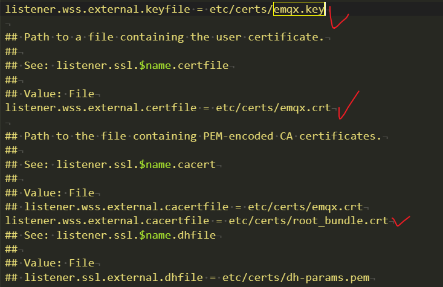

# 搭建基于emqx的mqtt服务器

参考链接：

[在云服务器上安装emqx+wss并使用ESP32连接 ](https://yuanze.wang/posts/emqx-wss-esp32/#测试服务器)

[物联网学习笔记3：在阿里云上部署EMQ及配置wss连接mqtt](https://blog.csdn.net/weixin_43440746/article/details/103791278)


## 安装emqx

参考链接2的方式，在服务器的面板下安装emqx，在这里谨慎的使用了其对应的旧版本进行安装，建议采用安装包的方式导入（因为采用链接在linux面板下下载的话会网速很慢甚至下载不了）


## 操作emqx

值得注意的是，因为没有配置环境，所以的话一系列对emqx的操作都需要进到其安装目录的bin文件夹进行命令操作

```
./emqx start
./emqx stop
./emqx restart
```

分别对应的开始，暂停和重启，在每次修改文件的时候都**需要重启emqx以达到想要的目的**


## 开启wss

emqx在安装好之后默认可以使用ws，而想要开启wss的websocket服务的话则需要添加ca证书等文件才可以启用（之前也是一直卡在这里导致一直开启不了）


在这里我使用的是腾讯云申请的证书，找到证书的路径之后，下载证书


然后选择apache的证书形式下载解压


解压后找到我们所需要的证书（**之前也是由于没有找对证书，所以花了很长时间，是不需要按照链接1的形式改后缀名或者合并证书的**）


后面我将其改名为了下面这样


然后放入服务器中emqx/etc/certs文件夹，最后修改emqx.conf文件的配置




这里注意一下名字对应（我这里把ssl和wss都加了证书），修改完之后保存


## 重启emqx

最后的最后一定要注意进入bin目录下**重启emqx以生效！！！**

mqtt的服务器搭建就完成了