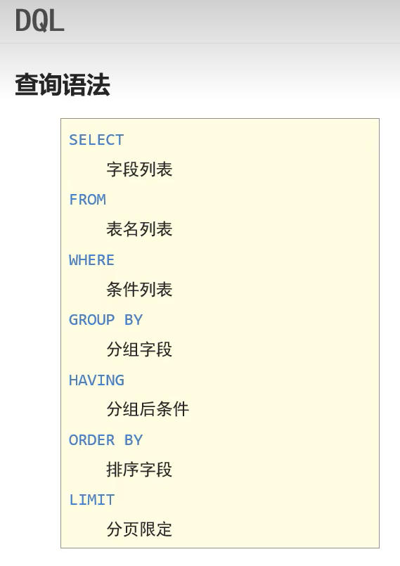
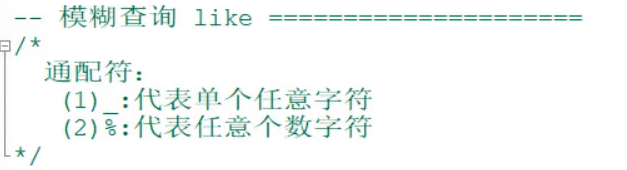
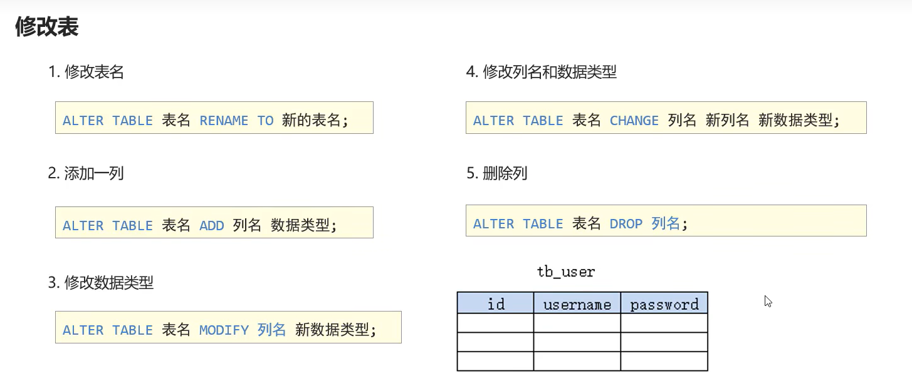
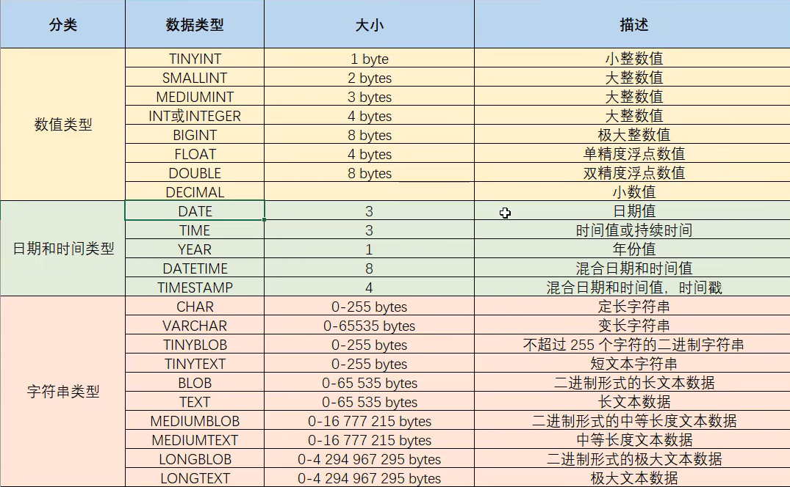
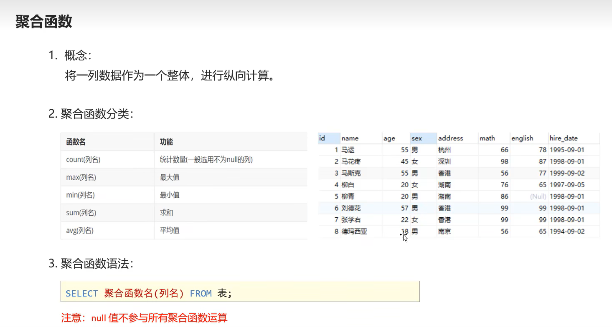
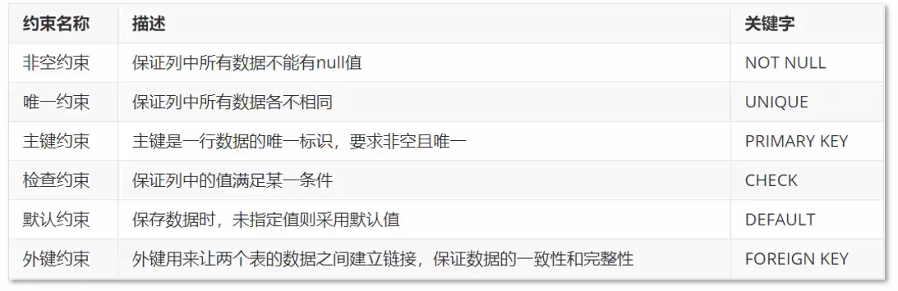
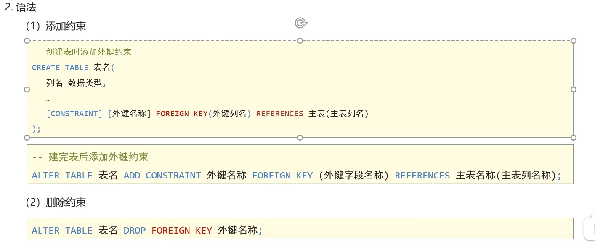

# navicat 的使用笔记

[TOC]

## 创建查询

---

1. 创建表格

   ```sql
   CREATE TABLE student(
   stuid int not null auto_increment PRIMARY KEY,
   stuname varchar(100),
   stustatus varchar(100)
   );
   ```

2. 插入数据

   ```sql
       insert into student (stuname,stustatus) value ("koliko", "nomal");
   ```

   > 插入多组数据只要多几个括号就行

3. 删除数据

   ```sql
   delete from student WHERE stuid = 1;
   ```

4. 修改数据

   ```sql
   UPDATE student set stuname = "kolikoko" , stustatus = "nice" where stuid = 2 ;
   ```

5. 查找数据

   ```sql
   SELECT * FROM student;
   SELECT * FROM student where stuid = 2;
   SELECT stuname, stustatus from student where stuid = 2;
   ```

   

   使用`distinct`可以删除重复的信息

   ```sql
   SELECT DISTINCT address FROM stu;
   ```

   使用`as`可以起别名让人看懂

   ```sql
   SELECT name as 姓名,age as 年龄 FROM stu;
   ```

6. 模糊查询

   

   ```sql 
   SELECT * FROM stu WHERE name like '马%';
   ```

7. 查询信息条数

   ```sql
   SELECT COUNT(*) from student;
   ```

8. 删除表

   ```sql
   truncate table student;//删除表，重置自增
   delete from student;//删除表，不重置
   drop table student;//销毁表
   ```

9. 覆盖信息(适合表格，覆盖主键的信息)

   ```sql
   REPLACE student ( stu_id, stu_name, stu_phone ) VALUES ( "222","che","123");
   ```


9. 给查找的数据表新建一个序号排序

   ```sql
   SELECT (@i:=@i+1) stu_count, s.*  FROM student s, (SELECT @i:=0) AS stu_count10.给查找的数据一个排序要求
   ```

10. 排序查询

    ```sql 
    SELECT * FROM student WHERE stu_first="新媒体部" or stu_second="新媒体部" ORDER BY stu_first;
    ```

可以添加升序或者降序排列，ASC:升序，DESC:降序排列

```sql
SELECT * FROM student WHERE stu_first="新媒体部" or stu_second="新媒体部" ORDER BY stu_first DESC;
```

可以进行多字段排序，前面的优先级高

```sql
SELECT * FROM student WHERE stu_first="新媒体部" or stu_second="新媒体部" ORDER BY stu_first DESC,stu_class ASC;
```

12. 分页查询（limit）

    ```sql 
    SELECT 字段列表 FROM 表名 LIMIT 起始索引,查询条目数;
    ```

    

13. 修改表数据

```sql
UPDATE 表名 SET 列名=值 [where 条件]；
```


14. 修改表




## 数据类型




1.double的使用

```sql
变量名字 double(总长度，小数点后的位数)
```


## 聚合函数




## 添加注释

在sql语言中添加注释需要使用`-- `

或者使用`/* */`


## 约束



自增长：`auto_increment`


添加外键约束（实现表与表之间的相互关联）




## 多表的查询

```sql
SELECT * FROM stu, class WHERE stu.dept_id = class.id
```


### 内连接

#### 隐式内连接

通过起别名来减少代码量，利用`.`进行类似于面向对象的操作

```sql
SELECT t1.name,t2.class_type FROM stu t1, class t2 WHERE t1.dept_id = t2.id;
```

#### 显式内连接

inner可以省略

```sql
SELECT * FROM stu inner join class on stu.dept_id = class.id;
```


### 外连接

#### 左外连接

查询emp表所有数据和对应部门的信息

```sql
select * from emp left join dept on emp.dep_id = dept.id;
```

#### 右外连接

查询dept表的所有数据和对应员工的信息

```sql
select * from emp right join dept on emp.dep_id = dept.id;
```


### 子查询

利用括号实现链式编程

```sql
select * from emp where salary > (select * from emp where id=10);
```

在多表查询当中使用


## 事务


