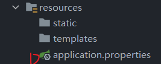
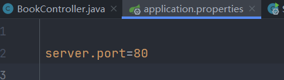
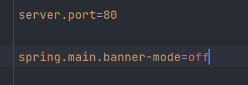
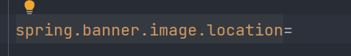

# spring boot的学习

学习原因：因为tomcat+war部署模式下在服务器中servlet访问一直404，遂尝试使用spring boot框架尝试绕开这种问题——2023.2.10


## spring boot入门

```java
@RestController
@RequestMapping("/books")
public class BookController {
    @GetMapping
    public String getById(){
        System.out.println("springboot is running...");
        return "spring boot is running...";
    }
}
```


## 一些配置操作


### 端口配置



在上面这个文件里面修改port为你想要的端口即可（默认是8080）




### banner配置



可以关掉启动时候的banner



可以修改你想要的图片为banner


### 日志配置

可以设置为你想要的输出日志，默认为info

```properties
logging.level.root=error
logging.level.root=debug
```


## 整合第三方技术


### 整合Junit


### 整合MyBatis

导入坐标or直接勾选并且配置

```properties
server:
  port: 80

spring:
  datasource:
    druid:
      driver-class-name: com.mysql.cj.jdbc.Driver
      url: jdbc:mysql://localhost:3306/user?serverTimeZone=UTC
      username: root
      password: abc123456

#配置表前缀
mybatis-plus:
  global-config:
    db-config:
      table-prefix: user
```