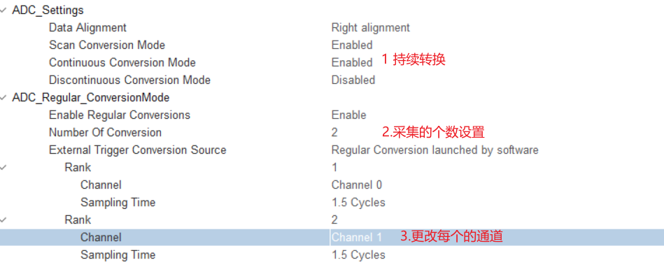
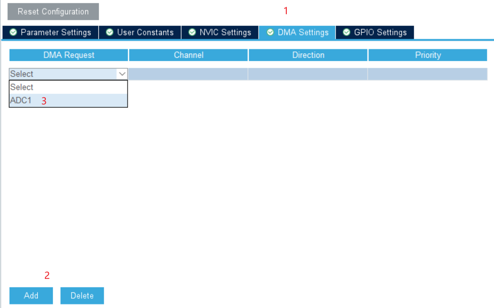
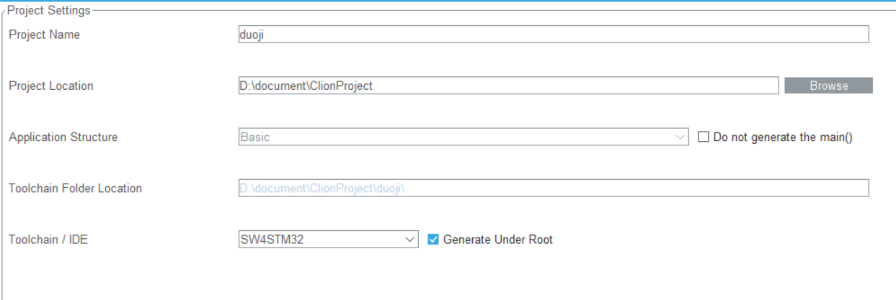

# STM32CUBEMX 使用笔记

[TOC]


## 基本操作

---

> 1.  打开 `rcc` 的高速时钟
> 2.  配置时钟树为最大的`72mhz`
> 3.  选择debug为ser...的那个
> 4.  `project`上选择开发的`mdk`编辑器
> 5.  `code generator`上勾选第一个

---


## 一些模块的使用

### PWM

> **频率**=定时器时钟/(pre 预分频+1）/(count period 计数值+1)

> **占空比**=Pulse 对比值/(count period 计数值)%

        HAL_TIM_PWM_Start(&htim2,TIM_CHANNEL_1);//定时器通道使能
        __HAL_TIM_SET_COMPARE(&htim2,TIM_CHANNEL_1,z);//修改占空比，使用z值来修改


### ADC 轮询采集


打开持续转换

```c
HAL_ADC_Start(&hadc1);//启动ADC转换

HAL_ADC_PollForConversion(&hadc1,50);//等待转换完成，第二个参数表示超时时间，单位ms
if(HAL_IS_BIT_SET(HAL_ADC_GetState(&hadc1),HAL_ADC_STATE_REG_EOC)){
    AD_Value= HAL_ADC_GetValue(&hadc1);
    printf("[\tmain]info:v=%.1fmv\r\n",AD_Value*3300.0/4096);
}
HAL_Delay(500);
```


### DMA转换

先调adc设置





然后,可以更改一下长度为`word`,模式为`circular`


写业务代码，DMA的搬运模式是从通道一然后通道二再循环回来搬运，从ADC_Value[0]到ADC_Value[99]然后再回到ADC_Value[0]。数组列这么长只是为了一点滤波，其实也可以不用这么长。

```c
HAL_ADC_Start_DMA(&hadc1,(uint32_t*)&ADC_Value,100);//启动ADC转换,第二个参数为数据存储起始地址，第三个参数为DMA传输数据的长度

	HAL_Delay(500);
	//简单的滤波
	for(i=0;i<100;i++){
	ad1+=ADC_Value[i++];
	ad2+=ADC_Value[i++];
	ad1/=50;
	ad2/=50;

	printf("\r\n********ADC-DMA-Example*********\r\n");
	printf("[\tmain]info:v=%1.3fmv\r\n",ad1*3300.0/4096);
	printf("[\tmain]info:v=%1.3fmv\r\n",ad2*3300.0/4096);

```


### OLED 显示

> 参考网站：https://blog.csdn.net/qq_39542860/article/details/105907958

注意：

- 包含头文件`oled.h`
- 初始化`OLED.Init()`
- `OLED_Clear(); `清屏操作
- `OLED_Display_On()；`操作打开显示屏！！！很重要(之前漏加了导致一直没有上电显示)，后面则不需要类似 _reflesh_ 的操作
- C6T6 的板子 Cubemx 有一个很傻逼的 bug，在 i2c 那里要修改一行代码` GPIO_InitStruct.Speed = GPIO_SPEED_FREQ_HIGH;`
- **最好不要用 oled 来 debug（OLED 的代码过长，如果在串口使用时，消息会丢失）**
- 在cubemx中使用的时候，&hi2c需要extern使用


### HC-05 蓝牙模块

> 参考资料：https://blog.csdn.net/qq_38410730/article/details/80368485 > https://blog.csdn.net/lzzzzzzm/article/details/114916509

默认波特率：9600
AT 模式下波特率：38400


### USART 串口收发

> 参考资料：https://www.bilibili.com/video/BV1q4411d7RX?p=9&vd_source=0eab86b58f0ee8a55b25e7648743b65a

- 阻塞式收发（必须要等收发完成后才执行下一步）

        uint8_t temp[] = "test";
        HAL_UART_Transmit(&huart2,temp,5,50);

- `printf` 重定向

                  int fputc(int ch, FILE *f){
                  uint8_t temp[1] = {ch};
                  HAL_UART_Transmit(&huart|, temp ,1, 2);
                  return ch;
                  }

  ！！！使用重定向必须勾选 `MicroLIB` (搞了我好久)

在串口收发的是时候不要轻易加操作，可能会触发中断导致接收异常（比如在接收里面加串口的发送）


### IO 口操作

> `Input` 操作：

        HAL_GPIO_ReadPin(GPIOA,GPIO_PIN_13)

> `Output` 操作

        HAL_GPIO_WritePin(GPIOA,GPIO_PIN_8,GPIO_PIN_RESET)
        HAL_GPIO_WritePin(GPIOA,GPIO_PIN_8,GPIO_PIN_SET)


### 矩阵键盘

- 可参考 22 年的省赛作品

扫描检测，一边使用推挽输出，一边使用 Input，上拉，按键按下时，下降沿触发中断，结合宏定义，节省代码时间，建议搭配定时器中断使用。

                A1;B1;C1;			//输出IO口置高，然后在进行检测
            uint8_t KeyNum=0;
    
                A0;					//A端IO口拉低检测
                if(a==0){KeyNum=1;HAL_Delay(20);while(a==0)HAL_Delay(20);}
                //下降沿触发，20ms消抖
                if(b==0){KeyNum=4;HAL_Delay(20);while(b==0)HAL_Delay(20);}
                if(c==0){KeyNum=7;HAL_Delay(20);while(c==0)HAL_Delay(20);}
                if(d==0){KeyNum=10;HAL_Delay(20);while(d==0)HAL_Delay(20);}
                A1;


### 定时器的中断

> cubemx 层

- 选择定时器
- 选择 `Internal clock` 配置预分频值和计数值（具体可参考 pwm 输出）
- 打开定时器中断，配置优先级。

> keil 层

- `HAL_TIM_Base_Start_IT(&htim2);` 打开定时器中断（**写在 tim 初始化函数的下面**）
- 写定时器中断回调函数，可以直接在`it.c`文件里面写

        void HAL_TIM_PeriodElapsedCallback(TIM_HandleTypeDef *htim)
        {
                static unsigned char ledState = 0;
                if (htim == (&htim2))
                {
        
                }
        }

再补充记录一些中断回调函数

#### 串口接收中断

```c
uint8_t Uart1_RxData;
HAL_UART_Receive_IT(&huart2, (uint8_t *)&Uart1_RxData, 1);   //先开启接收中断
```

```c
void HAL_UART_RxCpltCallback(UART_HandleTypeDef *huart)
{
    UNUSED(huart);
    if(huart == &huart2)//判断
    {
		//写协议
       	HAL_UART_Receive_IT(&huart2, (uint8_t *)&Uart1_RxData, 1);   //再开启接收中断
    }
}
```


#### ADC中断

```c
 void HAL_ADC_ConvCpltCallback(ADC_HandleTypeDef* hadc)
 {
   if(hadc.Instance == ADC1)
   {
     //在这里写代码，实现需要的功能
   }
 }

```

#### EXIT中断

```c
void HAL_GPIO_EXTI_Falling_Callback(uint16_t GPIO_Pin)
{
  if(GPIO_Pin == GPIO_PIN_12)    //EXTI12
  {
  }
  if(GPIO_Pin == GPIO_PIN_13)    //EXTI13
  {
  }
｝

```


### MPU6050

使用I2C与mpu6050进行通信，加速的测量过于简单所以这里就不做总结，重点在于如何求出欧拉角


参考教程

[STM32F1基于STM32CubeMX配置移植dmp库](https://blog.csdn.net/weixin_42880082/article/details/129121601)

[MPU6050如何通过惯性积分计算旋转角度(Yaw角)](https://blog.51cto.com/70565912/3747207)


这个难点在于移植还有欧拉角yaw的一个零偏处理，移植的问题在第一个教程当中有比较详细的源码可以参考（找了很久，走了很多错的方法），而零偏的话，可以参考第二个教程，相当于每次采样都减去偏移值。


## 优雅的嵌入式开发(配合Clion使用)	

这里参考稚晖君的文章[配置CLion用于STM32开发【优雅の嵌入式开发】 - 知乎 (zhihu.com)](https://zhuanlan.zhihu.com/p/145801160)

## 




前期的安装都没什么问题，但是在stlink的设置和printf的重定向就有点问题了

stlink有时候因为芯片是盗版的需要加入芯片的型号（在RCT6中出现）


### stlink烧录问题

正常配置如下

```
source [find interface/stlink-v2.cfg]

transport select hla_swd

source [find target/stm32f1x.cfg]

#reset_config srst_only
reset_config none
```

加了芯片型号需要修改成

```
source [find interface/stlink-v2.cfg]
set CPUTAPID 0x2ba01477 #zhe'li's
transport select hla_swd

source [find target/stm32f1x.cfg]

#reset_config srst_only
reset_config none

```


### printf重定向问题

先新建`retarget.c`和`retarget.h`文件

```c
#ifndef _RETARGET_H__
#define _RETARGET_H__

#include "stm32f1xx_hal.h"
#include <sys/stat.h>
#include <stdio.h>

void RetargetInit(UART_HandleTypeDef *huart);

int _isatty(int fd);

int _write(int fd, char *ptr, int len);

int _close(int fd);

int _lseek(int fd, int ptr, int dir);

int _read(int fd, char *ptr, int len);

int _fstat(int fd, struct stat *st);

#endif //#ifndef _RETARGET_H__
```

```c
#include <_ansi.h>
#include <_syslist.h>
#include <errno.h>
#include <sys/time.h>
#include <sys/times.h>
#include <retarget.h>
#include <stdint.h>

#if !defined(OS_USE_SEMIHOSTING)

#define STDIN_FILENO  0
#define STDOUT_FILENO 1
#define STDERR_FILENO 2

UART_HandleTypeDef *gHuart;

void RetargetInit(UART_HandleTypeDef *huart)
{
    gHuart = huart;

    /* Disable I/O buffering for STDOUT stream, so that
     * chars are sent out as soon as they are printed. */
    setvbuf(stdout, NULL, _IONBF, 0);
}

int _isatty(int fd)
{
    if (fd >= STDIN_FILENO && fd <= STDERR_FILENO)
        return 1;

    errno = EBADF;
    return 0;
}

int _write(int fd, char *ptr, int len)
{
    HAL_StatusTypeDef hstatus;

    if (fd == STDOUT_FILENO || fd == STDERR_FILENO)
    {
        hstatus = HAL_UART_Transmit(gHuart, (uint8_t *) ptr, len, HAL_MAX_DELAY);
        if (hstatus == HAL_OK)
            return len;
        else
            return EIO;
    }
    errno = EBADF;
    return -1;
}

int _close(int fd)
{
    if (fd >= STDIN_FILENO && fd <= STDERR_FILENO)
        return 0;

    errno = EBADF;
    return -1;
}

int _lseek(int fd, int ptr, int dir)
{
    (void) fd;
    (void) ptr;
    (void) dir;

    errno = EBADF;
    return -1;
}

int _read(int fd, char *ptr, int len)
{
    HAL_StatusTypeDef hstatus;

    if (fd == STDIN_FILENO)
    {
        hstatus = HAL_UART_Receive(gHuart, (uint8_t *) ptr, 1, HAL_MAX_DELAY);
        if (hstatus == HAL_OK)
            return 1;
        else
            return EIO;
    }
    errno = EBADF;
    return -1;
}

int _fstat(int fd, struct stat *st)
{
    if (fd >= STDIN_FILENO && fd <= STDERR_FILENO)
    {
        st->st_mode = S_IFCHR;
        return 0;
    }

    errno = EBADF;
    return 0;
}

#endif //#if !defined(OS_USE_SEMIHOSTING)
```

添加这两个文件到工程，更新CMake，编译之后会发现，有几个系统函数重复定义了

被重复定义的函数位于`Src`目录的`syscalls.c`文件中，**我们把里面重复的几个函数删掉即可。**

在main函数的初始化代码中添加对头文件的引用并注册重定向的串口号：

```c
#include "retarget.h"

RetargetInit(&huart1);
```

然后就可以愉快地使用`printf`和`scanf`啦：

```text
char buf[100];

printf("\r\nYour name: ");
scanf("%s", buf);
printf("\r\nHello, %s!\r\n", buf);
```
