# STM32CUBEMX 使用笔记

[TOC]


## 基本操作

---

> 1.  打开 `rcc` 的高速时钟
> 2.  配置时钟树为最大的`72mhz`
> 3.  选择debug为ser...的那个
> 4.  `project`上选择开发的`mdk`编辑器
> 5.  `code generator`上勾选第一个

---


## 一些模块的使用

### PWM

> **频率**=定时器时钟/(pre 预分频+1）/(count period 计数值+1)

> **占空比**=Pulse 对比值/(count period 计数值)%

```c
    HAL_TIM_PWM_Start(&htim2,TIM_CHANNEL_1);//定时器通道使能
    __HAL_TIM_SET_COMPARE(&htim2,TIM_CHANNEL_1,z);//修改占空比，使用z值来修改
```

**舵机配置**（占空比范围500-2500）

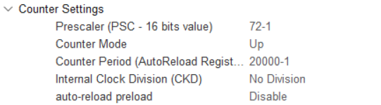


### ADC 轮询采集

x server:  port: 80​spring:  datasource:    druid:      driver-class-name: com.mysql.cj.jdbc.Driver      url: jdbc:mysql://localhost:3306/user?serverTimeZone=UTC      username: root      password: abc123456​#配置表前缀mybatis-plus:  global-config:    db-config:      table-prefix: userproperties

打开持续转换

```c
HAL_ADC_Start(&hadc1);//启动ADC转换

HAL_ADC_PollForConversion(&hadc1,50);//等待转换完成，第二个参数表示超时时间，单位ms
if(HAL_IS_BIT_SET(HAL_ADC_GetState(&hadc1),HAL_ADC_STATE_REG_EOC)){
    AD_Value= HAL_ADC_GetValue(&hadc1);
    printf("[\tmain]info:v=%.1fmv\r\n",AD_Value*3300.0/4096);
}
HAL_Delay(500);
```


### DMA转换

先调adc设置

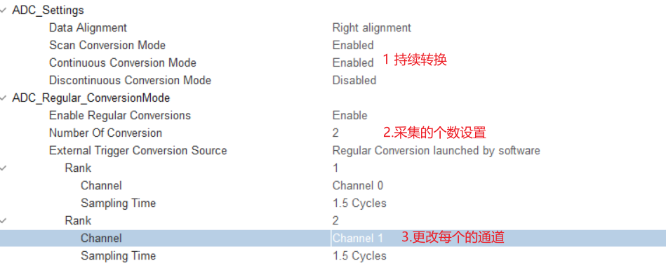

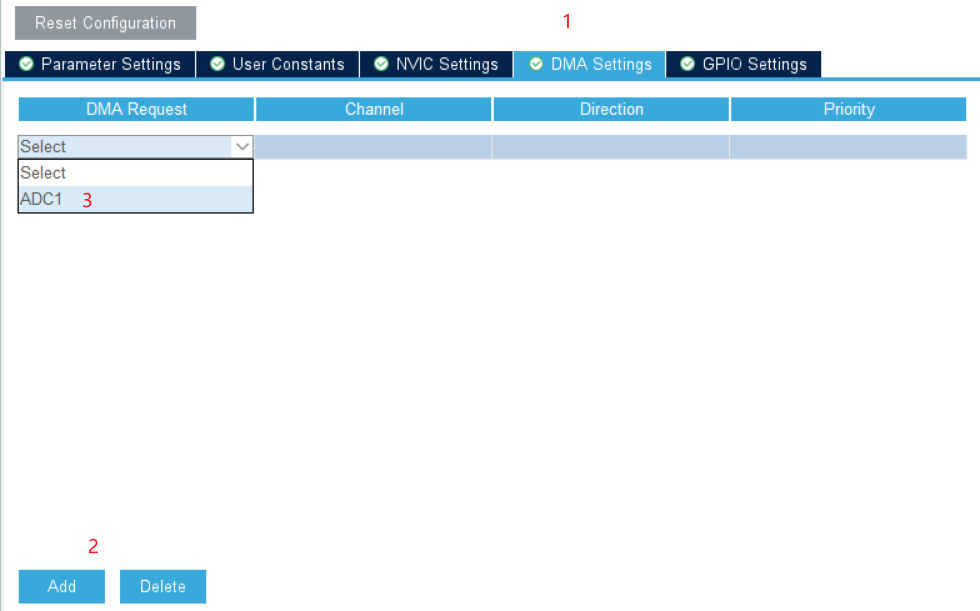

然后,可以更改一下长度为`word`,模式为`circular`


写业务代码，DMA的搬运模式是从通道一然后通道二再循环回来搬运，从ADC_Value[0]到ADC_Value[99]然后再回到ADC_Value[0]。数组列这么长只是为了一点滤波，其实也可以不用这么长。

```c
HAL_ADC_Start_DMA(&hadc1,(uint32_t*)&ADC_Value,100);//启动ADC转换,第二个参数为数据存储起始地址，第三个参数为DMA传输数据的长度

//循环z
		HAL_Delay(1000);
        //简单的滤波
        for (i = 0, ad1 = 0, ad2 = 0; i < 20; i += 2) {
            ad1 += ADC_Value[i];
            ad2 += ADC_Value[i + 1];
        }
        ad1 /= 10;
        ad2 /= 10;
        printf("\r\n********ADC-DMA-Example*********\r\n");
        printf("[\tmain]info:v=%1.3fmv\r\n", ad1 * 5000.0 / 4096);
        printf("[\tmain]info:v=%1.3fmv\r\n", ad2 * 5000.0 / 4096);

```


### OLED 显示

> 参考网站：https://blog.csdn.net/qq_39542860/article/details/105907958

注意：

- 包含头文件`oled.h`
- 初始化`OLED.Init()`
- `OLED_Clear(); `清屏操作
- `OLED_Display_On()；`操作打开显示屏！！！很重要(之前漏加了导致一直没有上电显示)，后面则不需要类似 _reflesh_ 的操作
- C6T6 的板子 Cubemx 有一个很傻逼的 bug，在 i2c 那里要修改一行代码` GPIO_InitStruct.Speed = GPIO_SPEED_FREQ_HIGH;`
- **最好不要用 oled 来 debug（OLED 的代码过长，如果在串口使用时，消息会丢失）**
- 在cubemx中使用的时候，&hi2c需要extern使用


### HC-05 蓝牙模块

> 参考资料：https://blog.csdn.net/qq_38410730/article/details/80368485 > https://blog.csdn.net/lzzzzzzm/article/details/114916509

默认波特率：9600
AT 模式下波特率：38400


### USART 串口收发

> 参考资料：https://www.bilibili.com/video/BV1q4411d7RX?p=9&vd_source=0eab86b58f0ee8a55b25e7648743b65a

- 阻塞式收发（必须要等收发完成后才执行下一步）

        uint8_t temp[] = "test";
        HAL_UART_Transmit(&huart2,temp,5,50);

- `printf` 重定向

                  int fputc(int ch, FILE *f){
                      uint8_t temp[1] = {ch};
                      HAL_UART_Transmit(&huart|, temp ,1, 2);
                      return ch;
                  }

  ！！！使用重定向必须勾选 `MicroLIB` (搞了我好久)

在串口收发的是时候不要轻易加操作，可能会触发中断导致接收异常（比如在接收里面加串口的发送）


### IO 口操作

> `Input` 操作：

        HAL_GPIO_ReadPin(GPIOA,GPIO_PIN_13)

> `Output` 操作

        HAL_GPIO_WritePin(GPIOA,GPIO_PIN_8,GPIO_PIN_RESET)
        HAL_GPIO_WritePin(GPIOA,GPIO_PIN_8,GPIO_PIN_SET)


### 矩阵键盘

- 可参考 22 年的省赛作品

扫描检测，一边使用推挽输出，一边使用 Input，上拉，按键按下时，下降沿触发中断，结合宏定义，节省代码时间，建议搭配定时器中断使用。

                A1;B1;C1;			//输出IO口置高，然后在进行检测
            uint8_t KeyNum=0;
    
                A0;					//A端IO口拉低检测
                if(a==0){KeyNum=1;HAL_Delay(20);while(a==0)HAL_Delay(20);}
                //下降沿触发，20ms消抖
                if(b==0){KeyNum=4;HAL_Delay(20);while(b==0)HAL_Delay(20);}
                if(c==0){KeyNum=7;HAL_Delay(20);while(c==0)HAL_Delay(20);}
                if(d==0){KeyNum=10;HAL_Delay(20);while(d==0)HAL_Delay(20);}
                A1;


### 定时器的中断

> cubemx 层

- 选择定时器
- 选择 `Internal clock` 配置预分频值和计数值（具体可参考 pwm 输出）
- 打开定时器中断，配置优先级。

> keil 层

- `HAL_TIM_Base_Start_IT(&htim2);` 打开定时器中断（**写在 tim 初始化函数的下面**）
- 写定时器中断回调函数，可以直接在`it.c`文件里面写

    ```c
    void HAL_TIM_PeriodElapsedCallback(TIM_HandleTypeDef *htim)
    {
            static unsigned char ledState = 0;
            if (htim == (&htim2))
            {
    			
            }
    }
    ```

再补充记录一些中断回调函数

#### 串口接收中断

```c
uint8_t Uart1_RxData;
HAL_UART_Receive_IT(&huart2, (uint8_t *)&Uart1_RxData, 1);   //先开启接收中断
```

```c
void HAL_UART_RxCpltCallback(UART_HandleTypeDef *huart)
{
    UNUSED(huart);
    if(huart == &huart2)//判断
    {
		//写协议
       	HAL_UART_Receive_IT(&huart2, (uint8_t *)&Uart1_RxData, 1);   //再开启接收中断
    }
}
```


#### ADC中断

```c
 void HAL_ADC_ConvCpltCallback(ADC_HandleTypeDef* hadc)
 {
   if(hadc.Instance == ADC1)
   {
     //在这里写代码，实现需要的功能
   }
 }

```

#### EXIT中断

```c
void HAL_GPIO_EXTI_Falling_Callback(uint16_t GPIO_Pin)
{
  if(GPIO_Pin == GPIO_PIN_12)    //EXTI12
  {
  }
  if(GPIO_Pin == GPIO_PIN_13)    //EXTI13
  {
  }
｝

```


#### 定时器中断

```c
HAL_TIM_Base_Start_IT(&htim2);//开启定时器中断

void HAL_TIM_PeriodElapsedCallback(TIM_HandleTypeDef *htim)//中断回调
{
    static unsigned char ledState = 0;
    if (htim == (&htim2))
    {
        if (ledState == 0)
            HAL_GPIO_WritePin(GPIOE,GPIO_PIN_15,GPIO_PIN_RESET);
        else
            HAL_GPIO_WritePin(GPIOE,GPIO_PIN_15,GPIO_PIN_SET);
        ledState = !ledState;
    }
}
```


### MPU6050

使用I2C与mpu6050进行通信，加速的测量过于简单所以这里就不做总结，重点在于如何求出欧拉角


参考教程

[STM32F1基于STM32CubeMX配置移植dmp库](https://blog.csdn.net/weixin_42880082/article/details/129121601)

[MPU6050如何通过惯性积分计算旋转角度(Yaw角)](https://blog.51cto.com/70565912/3747207)


这个难点在于移植还有欧拉角yaw的一个零偏处理，移植的问题在第一个教程当中有比较详细的源码可以参考（找了很久，走了很多错的方法），而零偏的话，可以参考第二个教程，相当于每次采样都减去偏移值。


### us级延时

因为hal库只有ms级的延时所以有时候需要使用us的延时，这里利用systick来做

```c
/*
Systick功能实现us延时
*/
uint32_t fac_us;

void HAL_Delay_us_init()
{
    fac_us=HAL_RCC_GetHCLKFreq() / 1000000;   //获取MCU的主频;
}

void HAL_Delay_us(uint32_t nus)
{
    uint32_t ticks;
    uint32_t told,tnow,tcnt=0;
    uint32_t reload=SysTick->LOAD;
    ticks=nus*fac_us;
    told=SysTick->VAL;
    while(1)
    {
        tnow=SysTick->VAL;
        if(tnow!=told)
        {
            if(tnow<told)tcnt+=told-tnow;
            else tcnt+=reload-tnow+told;
            told=tnow;
            if(tcnt>=ticks)break;
        }
    };
}
```


### CAN收发FIFO（使用瓴控电机为例子）

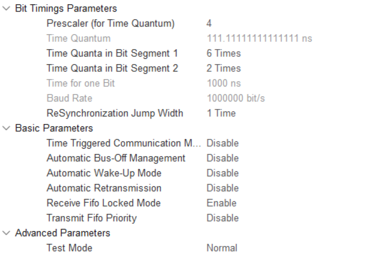

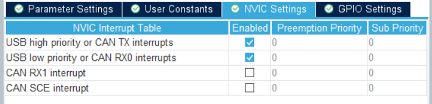

先配置stm32cubemx,配置波特率，配置中断。

**注意**：在使用通信的的时候，建议设备5v也要上电，因为在`HAL_CAN_Start(&hcan)`这个函数初始化如果rx没有拉高会初始化失败


然后编写一下函数，这里的添加过滤器和初始化can数据包头都需要放到can初始化后，可以放在`MX_CAN_Init`后面或者里面,代码中还以位置控制作为数据发送包的例子，接收回复编码器的值作为接收中断的例子

```c
#include "can.h"

CAN_TxHeaderTypeDef canTxHeader;
CAN_RxHeaderTypeDef canRxHeader;
uint8_t canTxData[8];
uint8_t canRxData[8];

uint16_t encoderValue = 0;


static uint16_t ctlValue = 10 * 100;
static uint32_t txMailBox;

//测试包大小
#define test_msg_size 5000
static uint16_t Send_msg = 0, Receive_msg = 0;

/**
  * @brief  MX_CAN_Filter:添加can过滤器，开启can以及接收中断
  * @param  null
  * @retval null
  */
void MX_CAN_Filter() {
    CAN_FilterTypeDef sFilterConfig;
    /* config can filter1 */
    sFilterConfig.FilterMode = CAN_FILTERMODE_IDMASK;    // 掩码模式
    sFilterConfig.FilterScale = CAN_FILTERSCALE_32BIT;   //32位掩码模式
    sFilterConfig.FilterIdHigh = (DEVICE_STD_ID) << 5;    // id，过滤器高16位
    sFilterConfig.FilterIdLow = 0x0000;
    sFilterConfig.FilterMaskIdHigh = 0xFC00;    // id mask	// 0xFC00
    sFilterConfig.FilterMaskIdLow = 0x0006;
    sFilterConfig.FilterFIFOAssignment = CAN_FILTER_FIFO0;
    sFilterConfig.FilterActivation = ENABLE;
    sFilterConfig.FilterBank = 0;
    if (HAL_CAN_ConfigFilter(&hcan, &sFilterConfig) != HAL_OK) {
        /* Initialization Error */
        Error_Handler();
    }

    /* config can filter2 */
    sFilterConfig.FilterMode = CAN_FILTERMODE_IDMASK;    // Identifier mask mode
    sFilterConfig.FilterScale = CAN_FILTERSCALE_32BIT;
    sFilterConfig.FilterIdHigh = (DEVICE_STD_BOARDCAST_ID) << 5;    // id
    sFilterConfig.FilterIdLow = 0x0000;
    sFilterConfig.FilterMaskIdHigh = 0xFFE0;    // id mask	// 0xFFE0
    sFilterConfig.FilterMaskIdLow = 0x0006;
    sFilterConfig.FilterFIFOAssignment = CAN_FILTER_FIFO0;
    sFilterConfig.FilterActivation = ENABLE;
    sFilterConfig.FilterBank = 14;
    if (HAL_CAN_ConfigFilter(&hcan, &sFilterConfig) != HAL_OK) {
        /* Initialization Error */
        Error_Handler();
    }

    /*##-3- Start the CAN peripheral ###########################################*/
    if (HAL_CAN_Start(&hcan) != HAL_OK) {
        /* Start Error */
        Error_Handler();
    }

    __HAL_CAN_ENABLE_IT(&hcan, CAN_IT_RX_FIFO0_MSG_PENDING);    // enable FIFO 0 message pending interrupt
}

/*********************************************************************************
* @brief	HAL_CAN_RxFifo0MsgPendingCallback, called in can interrupt  can接收中断
* @param	None
* @retval	None
*********************************************************************************/
void HAL_CAN_RxFifo0MsgPendingCallback(CAN_HandleTypeDef *hcan) {
    /* Get RX message */
    if (HAL_CAN_GetRxMessage(hcan, CAN_RX_FIFO0, &canRxHeader, canRxData) != HAL_OK) {
        /* Reception Error */
        Error_Handler();
    }

    if ((canRxHeader.StdId - DEVICE_STD_ID > 0) && (canRxHeader.DLC == 8)) {
        /* get encoder value */
//        encoderValue = (canRxData[7] << 8) + canRxData[6];
        if (canRxData[0] == 0x9A) {
            Receive_msg++;
        }
//        printf("EncoderValue: %d\r\n", encoderValue);
    }
}

/**
  * @brief  HAL_UART_RxCpltCallback 这个函数用来测试丢包的值
  * @param  htim 定时器的编号
  * @retval 无
  */
void HAL_TIM_PeriodElapsedCallback(TIM_HandleTypeDef *htim)//中断回调
{
    static float loss_rate;
    if (htim == (&htim2)) {

        if (Send_msg >= test_msg_size) {
            //计算丢包率
            loss_rate = ((float) Send_msg - (float) Receive_msg) / (float) Send_msg;
            printf("传输:%d/%d    ", Receive_msg, Send_msg);
            printf("丢包率:%.2f\r\n", loss_rate * 100);

            Send_msg = 0;
            Receive_msg = 1;//这里取1是为了保证丢包率的准确率
        }

        if (Send_msg % 2 == 1) {
            GetMotorState(1);
        } else if (Send_msg % 2 == 0) {
            GetMotorState(2);
        }

        Send_msg++;
    }
}


/**
  * @brief  初始化can数据包头
  * @param  motorId 电机id
  * @retval none
  */
void CanTxHeaderInit(uint8_t motorId) {
    canTxHeader.StdId = DEVICE_STD_ID + motorId;
    canTxHeader.ExtId = 0x00;
    canTxHeader.RTR = CAN_RTR_DATA;
    canTxHeader.IDE = CAN_ID_STD;
    canTxHeader.DLC = 8;
}

/**
  * @brief  电机关闭命令，将电机从开启状态（上电后默认状态）切换到关闭状态，清除电机转动圈数及之前接收的控
            制指令，LED 由常亮转为慢闪。此时电机仍然可以回复控制命令，但不会执行动作。
  * @param  motorId 电机id
  * @retval NULL
  */
void CloseMotor(uint8_t motorId) {
    CanTxHeaderInit(motorId);

    canTxData[0] = 0x80;
    canTxData[2] = 0x00;
    canTxData[2] = 0x00;
    canTxData[3] = 0x00;
    canTxData[4] = 0x00;
    canTxData[5] = 0x00;
    canTxData[6] = 0x00;
    canTxData[7] = 0x00;

    HAL_CAN_AddTxMessage(&hcan, &canTxHeader, canTxData, &txMailBox);
}

/**
  * @brief  电机运行命令，将电机从关闭状态切换到开启状态，LED 由慢闪转为常亮。此时再发送控制指令即可控制电机动作。
  * @param  motorId 电机id
  * @retval NULL
  */
void OpenMotor(uint8_t motorId) {
    CanTxHeaderInit(motorId);

    canTxData[0] = 0x88;
    canTxData[2] = 0x00;
    canTxData[2] = 0x00;
    canTxData[3] = 0x00;
    canTxData[4] = 0x00;
    canTxData[5] = 0x00;
    canTxData[6] = 0x00;
    canTxData[7] = 0x00;

    HAL_CAN_AddTxMessage(&hcan, &canTxHeader, canTxData, &txMailBox);
}

/**
  * @brief  电机停止命令,停止电机，但不清除电机运行状态。再次发送控制指令即可控制电机动作。
  * @param  motorId 电机id
  * @retval NULL
  */
void StopMotor(uint8_t motorId) {
    CanTxHeaderInit(motorId);

    canTxData[0] = 0x88;
    canTxData[2] = 0x00;
    canTxData[2] = 0x00;
    canTxData[3] = 0x00;
    canTxData[4] = 0x00;
    canTxData[5] = 0x00;
    canTxData[6] = 0x00;
    canTxData[7] = 0x00;

    HAL_CAN_AddTxMessage(&hcan, &canTxHeader, canTxData, &txMailBox);
}

/**
  * @brief  开环控制命令，主机发送该命令以控制输出到电机的开环电压
  * @param  motorId 电机id
  * @param  powerControl int16_t 类型，数值范围-850~ 850,（电机电流和扭矩因电机而异）
  * @retval NULL
  */
void OpenLoopControlMotor(uint8_t motorId, uint16_t powerControl) {
    CanTxHeaderInit(motorId);

    canTxData[0] = 0xA0;
    canTxData[2] = 0x00;
    canTxData[2] = 0x00;
    canTxData[3] = 0x00;
    canTxData[4] = *(uint8_t *) &powerControl;
    canTxData[5] = *((uint8_t *) &powerControl + 1);
    canTxData[6] = 0x00;
    canTxData[7] = 0x00;

    HAL_CAN_AddTxMessage(&hcan, &canTxHeader, canTxData, &txMailBox);
}

/**
  * @brief  转矩闭环控制命令，主机发送该命令以控制电机的转矩电流输出
  * @param  motorId 电机id
  * @param  iqControl int16_t 类型，数值范围-2048~ 2048，对应 MF 电机实际转矩电流范围-16.5A~16.5A，对应 MG 电机实际转矩电流范围-33A~33A
  * @retval NULL
  */
void TorqueClosedLoopControl(uint8_t motorId, uint16_t iqControl) {
    CanTxHeaderInit(motorId);

    canTxData[0] = 0xA1;
    canTxData[2] = 0x00;
    canTxData[2] = 0x00;
    canTxData[3] = 0x00;
    canTxData[4] = *(uint8_t *) &iqControl;
    canTxData[5] = *((uint8_t *) &iqControl + 1);
    canTxData[6] = 0x00;
    canTxData[7] = 0x00;

    HAL_CAN_AddTxMessage(&hcan, &canTxHeader, canTxData, &txMailBox);
}

/**
  * @brief  速度闭环控制命令，主机发送该命令以控制电机的速度
  * @param  motorId 电机id
  * @param  speedControl  int32_t 类型，对应实际转速为0.01dps/LSB int32_t 类型
  * @retval NULL
  */
void SpeedClosedLoopControl(uint8_t motorId, uint32_t speedControl) {
    CanTxHeaderInit(motorId);

    canTxData[0] = 0xA2;
    canTxData[2] = 0x00;
    canTxData[2] = 0x00;
    canTxData[3] = 0x00;
    canTxData[4] = *(uint8_t *) &speedControl;
    canTxData[5] = *((uint8_t *) &speedControl + 1);
    canTxData[6] = *((uint8_t *) &speedControl + 2);
    canTxData[7] = *((uint8_t *) &speedControl + 3);

    HAL_CAN_AddTxMessage(&hcan, &canTxHeader, canTxData, &txMailBox);
}

/**
  * @brief  多圈位置闭环控制命令 1，主机发送该命令以控制电机的位置（多圈角度）
  * @param  motorId 电机id
  * @param  angleControl  int32_t 类型，对应实际位置为 0.01degree/LSB，即 36000 代表 360°，电机转动方向由目标位置和当前位置的差值决定。
  * @retval NULL
  */
void MultiturnPositionClosedLoopControl(uint8_t motorId, uint32_t angleControl) {
    CanTxHeaderInit(motorId);

    canTxData[0] = 0xA3;
    canTxData[2] = 0x00;
    canTxData[2] = 0x00;
    canTxData[3] = 0x00;
    canTxData[4] = *(uint8_t *) &angleControl;
    canTxData[5] = *((uint8_t *) &angleControl + 1);
    canTxData[6] = *((uint8_t *) &angleControl + 2);
    canTxData[7] = *((uint8_t *) &angleControl + 3);

    HAL_CAN_AddTxMessage(&hcan, &canTxHeader, canTxData, &txMailBox);
}

/**
  * @brief  多圈位置闭环控制命令 2，主机发送该命令以控制电机的位置（多圈角度）
  * @param  motorId 电机id
  * @param  maxSpeed 限制了电机转动的最大速度，为 uint16_t 类型，对应实际转速 1dps/LSB，即 360 代表 360dps。
  * @param  angleControl  int32_t 类型，对应实际位置为 0.01degree/LSB，即 36000 代表 360°，电机转动方向由目标位置和当前位置的差值决定。
  * @retval NULL
  */
void MultiturnPositionClosedLoopSpeedControl(uint8_t motorId, uint16_t maxSpeed, uint32_t angleControl) {
    CanTxHeaderInit(motorId);

    canTxData[0] = 0xA3;
    canTxData[2] = 0x00;
    canTxData[2] = *(uint8_t *) &maxSpeed;
    canTxData[3] = *((uint8_t *) &maxSpeed + 1);
    canTxData[4] = *(uint8_t *) &angleControl;
    canTxData[5] = *((uint8_t *) &angleControl + 1);
    canTxData[6] = *((uint8_t *) &angleControl + 2);
    canTxData[7] = *((uint8_t *) &angleControl + 3);

    HAL_CAN_AddTxMessage(&hcan, &canTxHeader, canTxData, &txMailBox);
}

/**
  * @brief  SetMotorAngle设置电机单圈角度,主机发送该命令以控制电机的位置（单圈角度）
  * @param  motorId 电机id
  * @param  spinDirection 设置电机转动的方向，为 uint8_t 类型，0x00 代表顺时针，0x01 代表逆时针
  * @param  angleControl 对应实际位置为0.01degree/LSB，即36000代表360°
  * @retval NULL
  */
void SetMotorAngle(uint8_t motorId, uint8_t spinDirection, uint32_t angleControl) {
    CanTxHeaderInit(motorId);

    canTxData[0] = 0xA5;
    canTxData[1] = spinDirection;
    canTxData[2] = 0x00;
    canTxData[3] = 0x00;
    canTxData[4] = *(uint8_t *) &angleControl;
    canTxData[5] = *((uint8_t *) &angleControl + 1);
    canTxData[6] = *((uint8_t *) &angleControl + 2);
    canTxData[7] = *((uint8_t *) &angleControl + 3);

    HAL_CAN_AddTxMessage(&hcan, &canTxHeader, canTxData, &txMailBox);
}

/**
  * @brief  SetMotorAngleMaxSpeed 带最大速度设置单圈角度
  * @param  motorId 电机id
  * @param  spinDirection 设置电机转动的方向，为 uint8_t 类型，0x00 代表顺时针，0x01 代表逆时针
  * @param  angleControl 对应实际位置为0.01degree/LSB，即36000代表360°
  * @param  maxSpeed 限制了电机转动的最大速度，为 uint16_t 类型，对应实际转速1dps/LSB，即 360 代表 360dps
  * @retval NULL
  */
void SetMotorAngleMaxSpeed(uint8_t motorId, uint8_t spinDirection, uint32_t angleControl, uint16_t maxSpeed) {
    CanTxHeaderInit(motorId);

    canTxData[0] = 0xA6;
    canTxData[1] = spinDirection;
    canTxData[2] = *(uint8_t *) (&maxSpeed);
    canTxData[3] = *((uint8_t *) (&maxSpeed) + 1);
    canTxData[4] = *(uint8_t *) (&angleControl);
    canTxData[5] = *((uint8_t *) (&angleControl) + 1);
    canTxData[6] = *((uint8_t *) (&angleControl) + 2);
    canTxData[7] = *((uint8_t *) (&angleControl) + 3);

    HAL_CAN_AddTxMessage(&hcan, &canTxHeader, canTxData, &txMailBox);
}

/**
  * @brief  SetMotorAddAngle 增量式位置控制闭环
  * @param  motorId 电机id
  * @param  angleIncrement 对应实际增加角度 为0.01degree/LSB，即36000代表360°
  * @retval NULL
  */
void SetMotorAddAngle(uint8_t motorId, uint32_t angleIncrement) {
    CanTxHeaderInit(motorId);

    canTxData[0] = 0xA7;
    canTxData[1] = 0x00;
    canTxData[2] = 0x00;
    canTxData[3] = 0x00;
    canTxData[4] = *((uint8_t *) &angleIncrement + 0);
    canTxData[5] = *((uint8_t *) &angleIncrement + 1);
    canTxData[6] = 0x00;
    canTxData[7] = 0x00;

    HAL_CAN_AddTxMessage(&hcan, &canTxHeader, canTxData, &txMailBox);
}


/**
  * @brief  GetMotorState 读取当前电机的温度、电压和错误状态标志
  * @param  motorId 获取电机信息的id
  * @retval NULL
  */
void GetMotorState(uint8_t motorId) {
    CanTxHeaderInit(motorId);

    canTxData[0] = 0x9A;
    canTxData[1] = 0x00;
    canTxData[2] = 0x00;
    canTxData[3] = 0x00;
    canTxData[4] = 0x00;
    canTxData[5] = 0x00;
    canTxData[6] = 0x00;
    canTxData[7] = 0x00;

    HAL_CAN_AddTxMessage(&hcan, &canTxHeader, canTxData, &txMailBox);
}


```


再加一下.h文件

```c
#ifndef MOTOR_TEST_CAN_H
#define MOTOR_TEST_CAN_H

#include "main.h"

#define DEVICE_STD_ID                        (0x140)
#define DEVICE_STD_BOARDCAST_ID    (0x280)

#define CAN_SHDN_Pin              GPIO_PIN_7    // shutdown
#define CAN_SHDN_GPIO_Port        GPIOB
#define CAN_SHDN_ENABLE()         HAL_GPIO_WritePin(CAN_SHDN_GPIO_Port, CAN_SHDN_Pin, GPIO_PIN_SET)
#define CAN_SHDN_DISABLE()        HAL_GPIO_WritePin(CAN_SHDN_GPIO_Port, CAN_SHDN_Pin, GPIO_PIN_RESET)

extern CAN_HandleTypeDef hcan;
extern TIM_HandleTypeDef htim2;
extern CAN_TxHeaderTypeDef canTxHeader;
extern CAN_RxHeaderTypeDef canRxHeader;
extern uint8_t canTxData[];
extern uint8_t canRxData[];

void MX_CAN_Filter(void);

void CanTxHeaderInit(uint8_t motorId);

void CloseMotor(uint8_t motorId);

void OpenMotor(uint8_t motorId);

void StopMotor(uint8_t motorId);

void OpenLoopControlMotor(uint8_t motorId, uint16_t powerControl);

void TorqueClosedLoopControl(uint8_t motorId, uint16_t iqControl);

void SpeedClosedLoopControl(uint8_t motorId, uint32_t speedControl);

void MultiturnPositionClosedLoopControl(uint8_t motorId, uint32_t angleControl);

void MultiturnPositionClosedLoopSpeedControl(uint8_t motorId, uint16_t maxSpeed, uint32_t angleControl);

void SetMotorAngle(uint8_t motorId, uint8_t spinDirection, uint32_t angleControl);

void SetMotorAngleMaxSpeed(uint8_t motorId, uint8_t spinDirection, uint32_t angleControl, uint16_t maxSpeed);

void SetMotorAddAngle(uint8_t motorId, uint32_t angleIncrement);

void GetMotorState(uint8_t motorId);

#endif //MOTOR_TEST_CAN_H

```


### 编码器使用

[STM32CubeMX 编码器测速](https://blog.csdn.net/qq_59953808/article/details/130297562)

先使用`Encoder Mode`

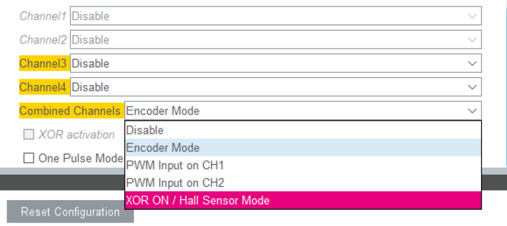


然后配置编码器，10是滤波

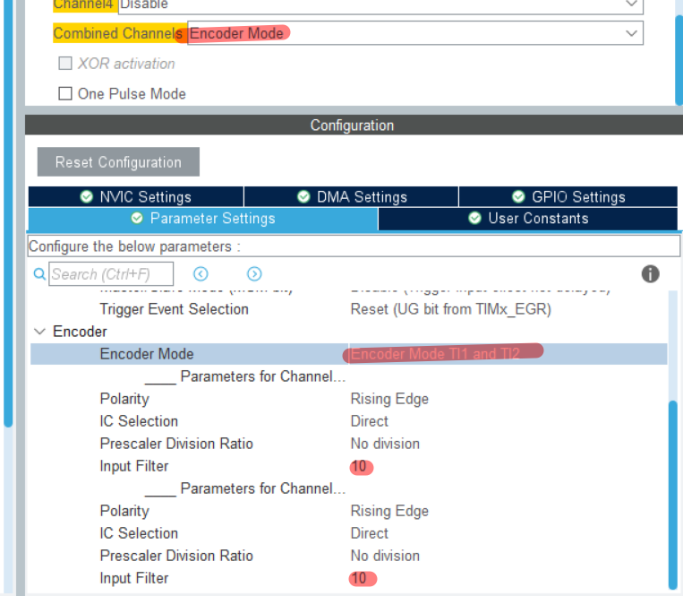

在引入encoder.c和.h文件

**encoder.c**

```c
#include "encode.h"
/**************************************************************************
函数功能：单位时间读取编码器计数
入口参数：定时器
返回  值：速度值
**************************************************************************/
int Read_Encoder(void)//读取计数器的值
{
  int Encoder_TIM;
	
	Encoder_TIM=(short)ENCODE_TIMX->CNT; ENCODE_TIMX ->CNT=0;

  return Encoder_TIM;
}
```

**encoder.h**

```c
#ifndef __ENCODE_H
#define __ENCODE_H
#include "main.h"
#define ENCODE_TIMX TIM4
int Read_Encoder(void);//读取计数器的值
#endif
```


在定时器中断里面调用即可

```c
void HAL_TIM_PeriodElapsedCallback(TIM_HandleTypeDef *htim)
{
  if(htim==(&htim9))//因为我采用的是定时器6
  {	
		printf("%d",Read_Encoder());
  }
}
```


注意,ENCODE_TIMX这里面的要改成自己的定时器TIM(?)

```c
Encoder_TIM=(short)ENCODE_TIMX->CNT; ENCODE_TIMX ->CNT=0;
```


### 看门狗

勾选独立看门狗

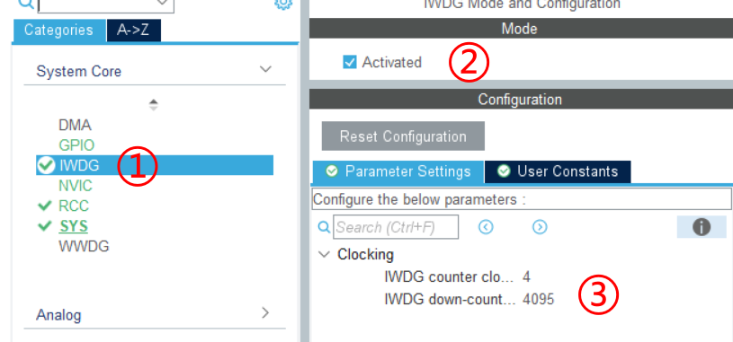

配置时间

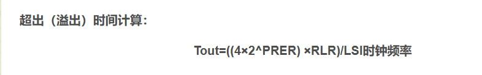

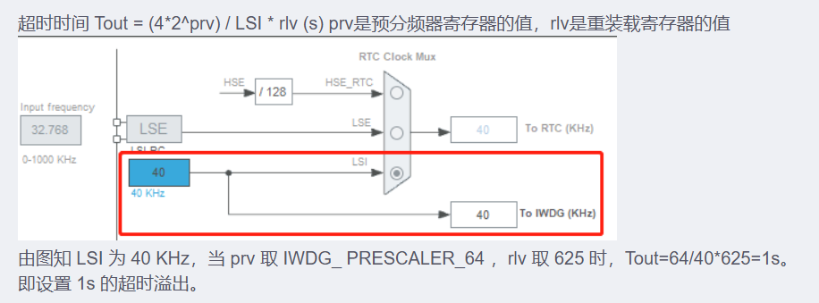

然后在程序里面溢出时间内喂狗就好了`HAL_IWDG_Refresh(&hiwdg);//喂狗`


## 优雅的嵌入式开发(配合Clion使用)	

这里参考稚晖君的文章[配置CLion用于STM32开发【优雅の嵌入式开发】 - 知乎 (zhihu.com)](https://zhuanlan.zhihu.com/p/145801160)

图里面的Toolchain可以换成stm32cubeIDE

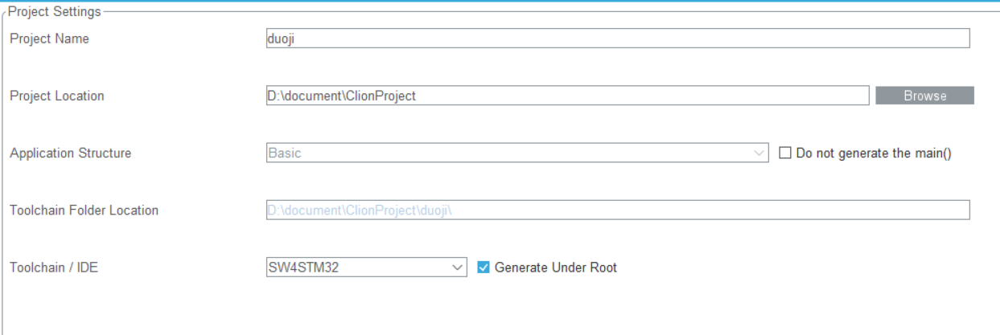


前期的安装都没什么问题，但是在stlink的设置和printf的重定向就有点问题了

stlink有时候因为芯片是盗版的需要加入芯片的型号（在RCT6中出现）


### stlink烧录问题

正常配置如下

```
source [find interface/stlink-v2.cfg]

transport select hla_swd

source [find target/stm32f1x.cfg]

#reset_config srst_only
reset_config none
```

加了芯片型号需要修改成

```
source [find interface/stlink-v2.cfg]
set CPUTAPID 0x2ba01477 #zhe'li's
transport select hla_swd

source [find target/stm32f1x.cfg]

#reset_config srst_only
reset_config none

```


### printf重定向问题

先新建`retarget.c`和`retarget.h`文件

```c
#ifndef _RETARGET_H__
#define _RETARGET_H__

#include "stm32f1xx_hal.h"
#include <sys/stat.h>
#include <stdio.h>

void RetargetInit(UART_HandleTypeDef *huart);

int _isatty(int fd);

int _write(int fd, char *ptr, int len);

int _close(int fd);

int _lseek(int fd, int ptr, int dir);

int _read(int fd, char *ptr, int len);

int _fstat(int fd, struct stat *st);

#endif //#ifndef _RETARGET_H__
```

```c
    #include <_ansi.h>
    #include <_syslist.h>
    #include <errno.h>
    #include <sys/time.h>
    #include <sys/times.h>
    #include <retarget.h>
    #include <stdint.h>

    #if !defined(OS_USE_SEMIHOSTING)

    #define STDIN_FILENO  0
    #define STDOUT_FILENO 1
    #define STDERR_FILENO 2

    UART_HandleTypeDef *gHuart;

    void RetargetInit(UART_HandleTypeDef *huart)
    {
        gHuart = huart;

        /* Disable I/O buffering for STDOUT stream, so that
         * chars are sent out as soon as they are printed. */
        setvbuf(stdout, NULL, _IONBF, 0);
    }

    int _isatty(int fd)
    {
        if (fd >= STDIN_FILENO && fd <= STDERR_FILENO)
            return 1;

        errno = EBADF;
        return 0;
    }

    int _write(int fd, char *ptr, int len)
    {
        HAL_StatusTypeDef hstatus;

        if (fd == STDOUT_FILENO || fd == STDERR_FILENO)
        {
            hstatus = HAL_UART_Transmit(gHuart, (uint8_t *) ptr, len, HAL_MAX_DELAY);
            if (hstatus == HAL_OK)
                return len;
            else
                return EIO;
        }
        errno = EBADF;
        return -1;
    }

    int _close(int fd)
    {
        if (fd >= STDIN_FILENO && fd <= STDERR_FILENO)
            return 0;

        errno = EBADF;
        return -1;
    }

    int _lseek(int fd, int ptr, int dir)
    {
        (void) fd;
        (void) ptr;
        (void) dir;

        errno = EBADF;
        return -1;
    }

    int _read(int fd, char *ptr, int len)
    {
        HAL_StatusTypeDef hstatus;

        if (fd == STDIN_FILENO)
        {
            hstatus = HAL_UART_Receive(gHuart, (uint8_t *) ptr, 1, HAL_MAX_DELAY);
            if (hstatus == HAL_OK)
                return 1;
            else
                return EIO;
        }
        errno = EBADF;
        return -1;
    }

    int _fstat(int fd, struct stat *st)
    {
        if (fd >= STDIN_FILENO && fd <= STDERR_FILENO)
        {
            st->st_mode = S_IFCHR;
            return 0;
        }

        errno = EBADF;
        return 0;
    }

    #endif //#if !defined(OS_USE_SEMIHOSTING)
```

添加这两个文件到工程，更新CMake，编译之后会发现，有几个系统函数重复定义了

被重复定义的函数位于`Src`目录的`syscalls.c`文件中，**我们把里面重复的几个函数删掉即可。**

在main函数的初始化代码中添加对头文件的引用并注册重定向的串口号：

```c
#include "retarget.h"

RetargetInit(&huart1);
```

然后就可以愉快地使用`printf`和`scanf`啦：

```text
char buf[100];

printf("\r\nYour name: ");
scanf("%s", buf);
/
```


### 中文乱码问题

stm32cubemx在重新生成代码的时候，会有中文乱码的问题，这里可以采用添加环境变量的方法解决。

- 变量名称：`JAVA_TOOL_OPTIONS`
- 变量值：`-Dfile.encoding=UTF-8`

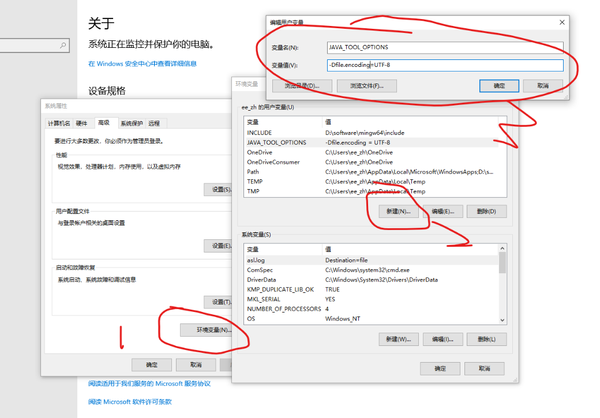


### 烧录H7时候报错

```shell
FAILED: Ctr_Board.elf 

d:/app/jetbrains/stm32-clion/gcc-arm-none-eabi-10.3-2021.10/bin/../lib/gcc/arm-none-eabi/10.3.1/../../../../arm-none-eabi/bin/ld.exe:D:/document/ClionProject/Ctr_Board/STM32H723VGTX_FLASH.ld:91: non constant or forward reference address expression for section .ARM.extab
collect2.exe: error: ld returned 1 exit status
```

原因：
最新的 STM32CubeMx 生成的 .ld 文件中含有 **READONLY** 关键字，此关键字只能在 gcc 11 版本及以后使用，gcc 10及以下版本解析不了报错。（在后面生成的注释中也有说明）

解决方法：
打开 .ld 文件，删除所有 (READONLY) 字段

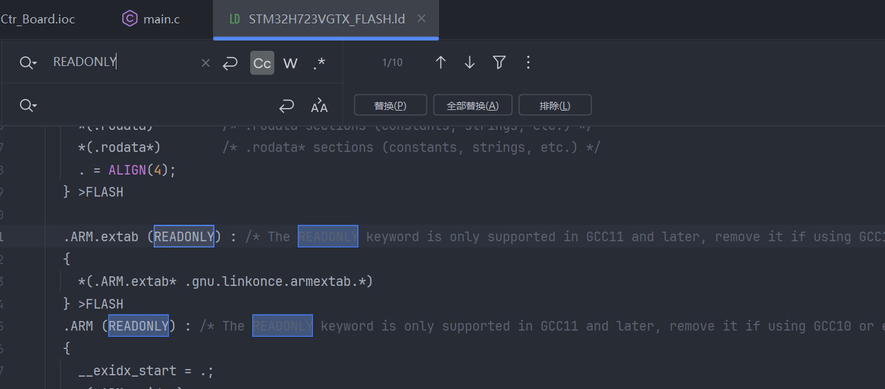


### 使用FreeRTOS时报错

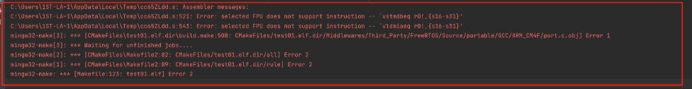

```cmake
#Uncomment for hardware floating point
add_compile_definitions(ARM_MATH_CM4;ARM_MATH_MATRIX_CHECK;ARM_MATH_ROUNDING)
add_compile_options(-mfloat-abi=hard -mfpu=fpv4-sp-d16)
add_link_options(-mfloat-abi=hard -mfpu=fpv4-sp-d16)
```

需要将cmakelist.txt的这个地方取消注释掉


