# 小程序的学习

## 前端

### 一些标签

`<view></view>` 类似于html中的div标签

`<scroll-view></scroll-view>` 一个可以滚动的盒子，需要设置高度或者宽度

`<swiper></swiper>`轮播图组件

`<text userselect></text>`用户可选定的文本状态

`<rich></rich>`可以修改文本样式

`<button></button>`按钮，修改type来更改样式,primary:主调色；warn：警告；mini：小按钮；

`<image></image>`图片标签，Mode属性可以修改图片的样式

## 事件

### 渲染层到逻辑层的事件

`bindtap`绑定手指触摸事件，（例如再button标签中使用`bindtap=""`来绑定再 `js`文件中的函数）

`this.setData` 数据传参与数据同步，比如这样：

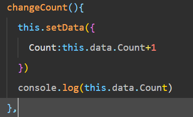

`wx:if` 条件渲染类似于条件语句

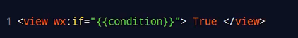

## 模板样式.wxss

大部分和css是一样的

### 导航栏以及下拉背景的配置

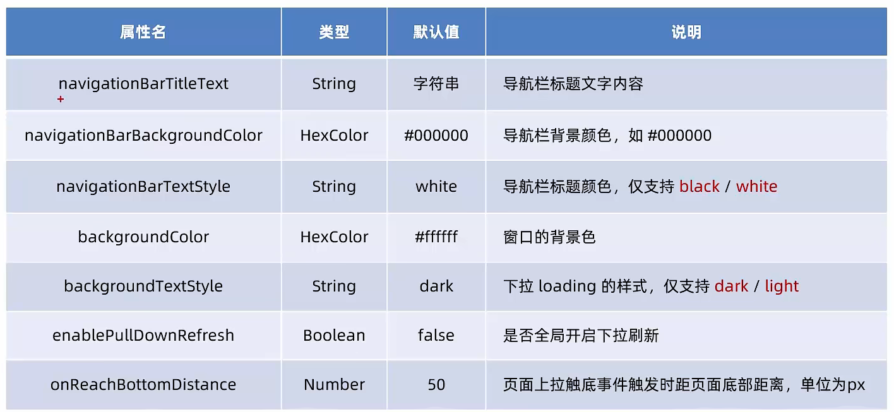

### tabBar的配置

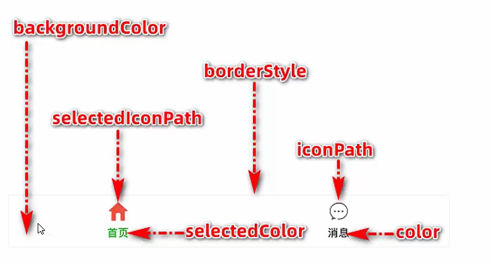

### 网络数据请求

配置request的合法域名，在微信公众平台的开发上进行设置。

#### 发起get请求

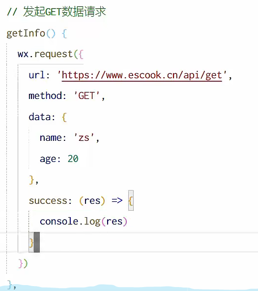

#### 发起post请求

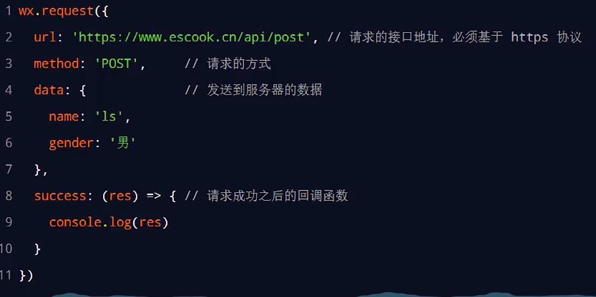

#### 生命周期onload函数

在每次加载的时候即调用

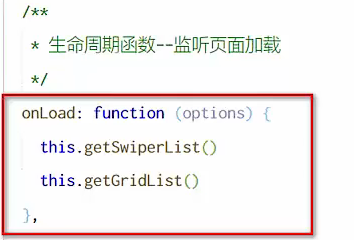

## 页面导航

### 声明式导航

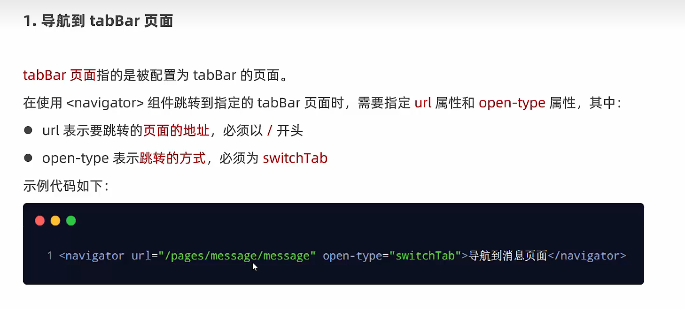

如果不是`tabBa`r页面的话，open-type的属性为navigate，当然也可以省略不写。

后退导航，open-type属性为 `navigateBack` ,delta设置为后退的级数，不写的话默认的级数就是1

### 编程式导航

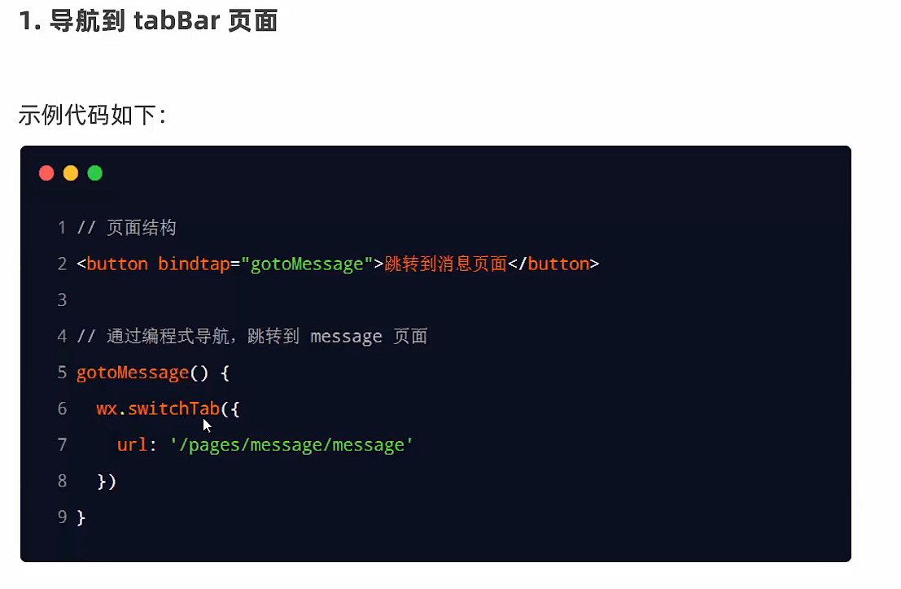

类似的，非`tabBar`导航使用函数为`wx.navigateTo();wx.navigateBack()`

## 导航传参

### 声明式导航传参

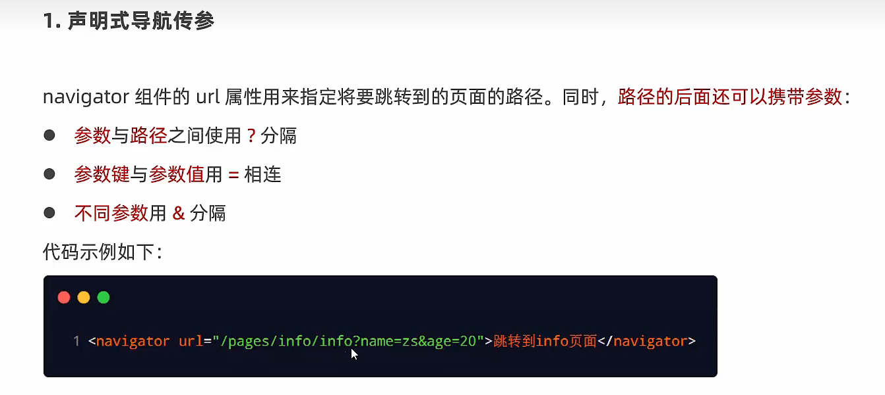

### 编程式导航传参

同理

## 页面事件

### 下拉刷新

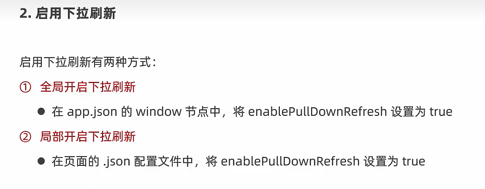

下拉之后是不会自动回去的需要调用函数`wx.stoppPullDownRefresh()`函数

### 上拉触底

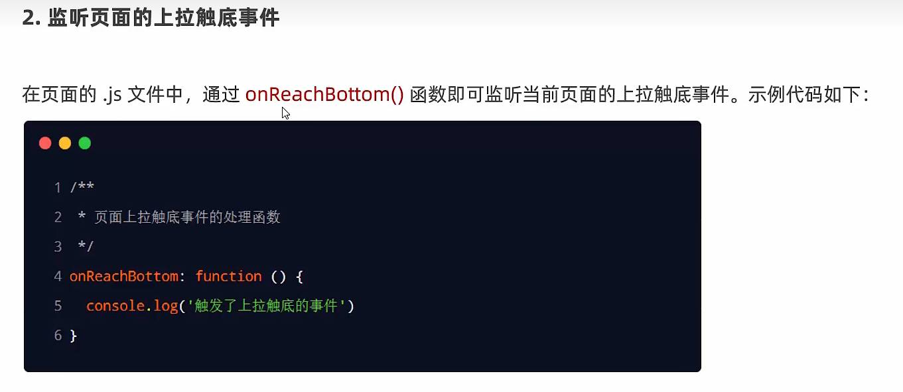

## 生命周期

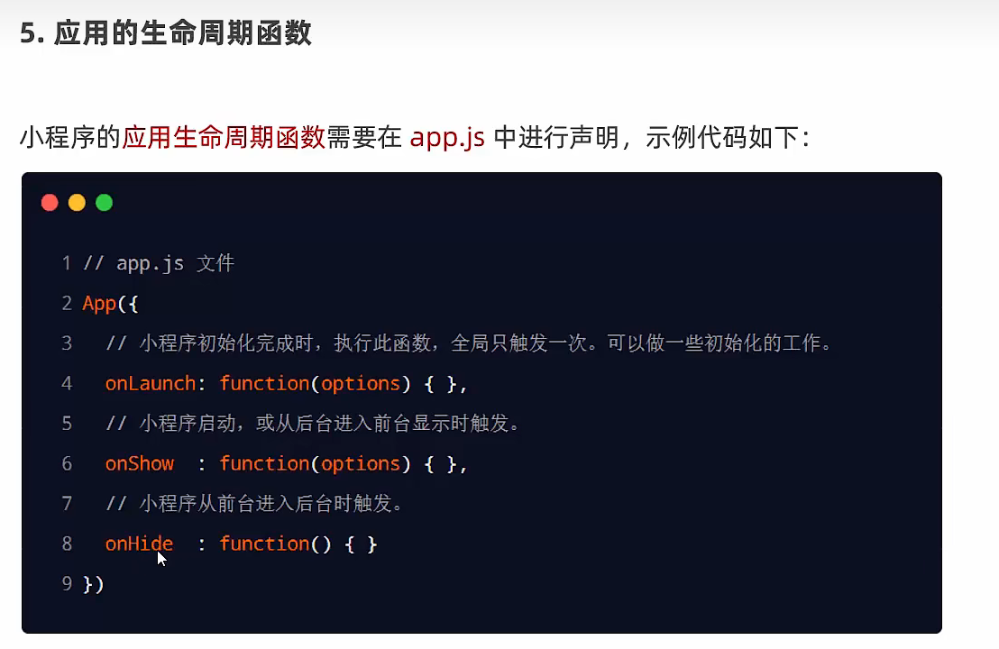

了解一些生命周期的函数，类似于中断

## .wxs脚本

可以简单的理解为JavaScript，用的时候再参考吧，分为内嵌式和外联式，也和js是一样的基本
