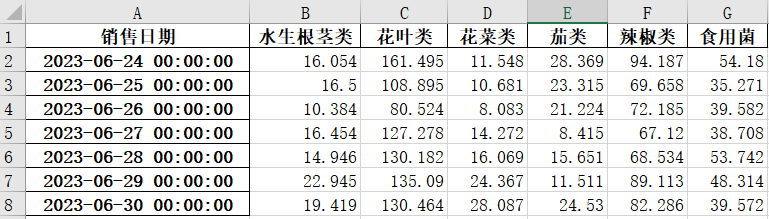
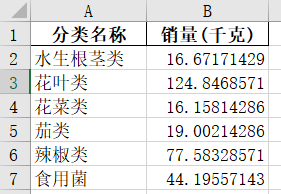

# 第三问


## 第一步 处理单品类

单品类的销售量：这里取对六天每一天单个种类进行统计，取销售量最大的那天（因为种类要求少了，正常一天一般是40个种类，所以这里取大的）

先处理单品类的定价，这里经过观察发现一天内的定价是不变的（去掉非打折之后），所以我们的定价在这里和销售量绑定（两者相关），取哪一天（这里选销售量最大的那天）就用哪一天的定价


## 第二步 处理大分类

这里的我们利用近六天数据得出单日各品类蔬菜的需求量


观察发现每天的每个类的量区别不是很大，于是这里采用求平均方式对7月1日的需求量进行预测




## 第三步

利用线性规划求解以上问题

主要满足：

- 目标函数最大
- 满足需求量
- 27-33单品
- 单品补货量>2.5


```python
import pandas as pd
import pulp

# 读取Excel数据
file = '单类最高销量及利润率.xlsx'
data = pd.read_excel(file)

# 过滤出有用的列
data = data[['单品编码', '销量(千克)', '单品名称', '分类名称', '利润率', '销售单价(元/千克)']]

# 根据分类名称计算每种分类的总销售量
desired_sales = {
    '食用菌': 44.19,  # 假设需要的销售量
    '花叶类': 124.84,  # 假设需要的销售量
    '茄类': 19.00,  # 假设需要的销售量
    '花菜类': 16.15,  # 假设需要的销售量
    '水生根茎类': 16.67,  # 假设需要的销售量
    '辣椒类': 77.58  # 假设需要的销售量
}

# 创建线性规划问题
model = pulp.LpProblem("Maximize_Profit", pulp.LpMaximize)

# 创建单品选择变量
selected_items = pulp.LpVariable.dicts("Item", data['单品编码'], cat=pulp.LpBinary)

# 目标函数：最大化总利润
model += pulp.lpSum(selected_items[item] * data.loc[data['单品编码'] == item, '利润率'].values[0]
                    for item in data['单品编码'])

# 添加约束条件：每种分类的总销售量要满足需求
for category, demand in desired_sales.items():
    items_in_category = data[data['分类名称'] == category]['单品编码']
    model += pulp.lpSum(selected_items[item] * 1.5 * data.loc[data['单品编码'] == item, '销量(千克)'].values[0]
                        for item in items_in_category) >= demand

# 添加约束条件：选择的单品数量在27-33之间

model += pulp.lpSum(selected_items[item] for item in data['单品编码']) >= 27
model += pulp.lpSum(selected_items[item] for item in data['单品编码']) <= 33

# 添加约束条件：每个选定的单品的销量必须满足2.5千克
for item in data['单品编码']:
    model += selected_items[item] * data.loc[data['单品编码'] == item, '销量(千克)'].values[0] >= 2.5

# 求解线性规划问题
model.solve()

# 打印结果
selected_item_codes = [item for item in data['单品编码'] if selected_items[item].varValue > 0]

selected_items_df = data[data['单品编码'].isin(selected_item_codes)]
print("选定的单品：")
print(selected_items_df[['单品编码', '单品名称', '分类名称', '销量(千克)', '利润率']])

print("总利润：", pulp.value(model.objective))
# 导出选定的单品和总利润到Excel表格
output_file = 'selected_items_and_profit.xlsx'

selected_items_df[['单品编码', '单品名称', '分类名称', '销量(千克)', '利润率', '销售单价(元/千克)']].to_excel(
    output_file, index=False)

print("结果已导出到Excel表格:", output_file)

```


**注意**：碰到的问题就是33个仍不能满足需求，需要大概40个才可以满足，这里考虑到个数减少了，顾客商品选择也减少了（但还是会买同类的商品替代），所以这里提升了商品的“销售能力”，即对每个商品的销量乘以了1.5的系数（此时刚好满足33个单品类满足需求的条件）。最后还有出现进货量1.几的情况，考虑到对利润影响不大进行了将低于2.5的提高到2.5的处理


刚刚试了一下，好像不加>2.5约束条件是可以做到的，就不用加1.5的系数，这里先采用不加条件然后手动将低于2.5的提高到2.5的处理的方法做（后面可以再改


**目标函数（Objective Function）**：

最大化总利润，其中总利润由以下公式计算：
$$
Total Profit = ∑(p_item * x_item * Sales)
$$
其中：
- `p_item` 表示单品 `item` 的利润率。
- `x_item` 表示是否选择单品 `item`（取值为0或1）。
- `Sales` 表示单品的销量（千克）。

**约束条件（Constraints）**：

1. 每种分类的总销售量要满足需求：
   对于每个分类，总销售量至少满足需求，其中总销售量由以下公式计算：

$$
∑(s_item * x_item) ≥ Demand
$$

其中：
- `s_item` 表示单品 `item` 的销量（千克）。
- `x_item` 表示是否选择单品 `item`（取值为0或1）。
- `Demand` 表示该分类的需求量。

2. 选择的单品数量在27-33之间：

$$
27 ≤ ∑(x_item) ≤ 33
$$

3. 每个单品的补货量要大于2.5：
   $$
   r_item ≥ 2.5 * x_item
   $$
   其中：
   - `r_item` 表示单品 `item` 的补货量。
   - `x_item` 表示是否选择单品 `item`（取值为0或1）。


4. 利润率约束条件： 利润率由以下公式计算，并必须大于或等于某个阈值 `Min Profit Rate`： 

$$
p_item = (Sales * Item Price - (Sales / (1 - Loss Rate)) * Cost Price) / ((Sales / (1 - Loss Rate)) * Cost Price) ≥ Min Profit Rate
$$

​	其中：
- `p_item` 表示单品 `item` 的利润率。
- `Sales` 表示单品的销量（千克）。
- `Item Price` 表示单品的售价。
- `Loss Rate` 表示损耗率。
- `Cost Price` 表示单品的成本价。
- `Min Profit Rate` 表示要求的最小利润率阈值。