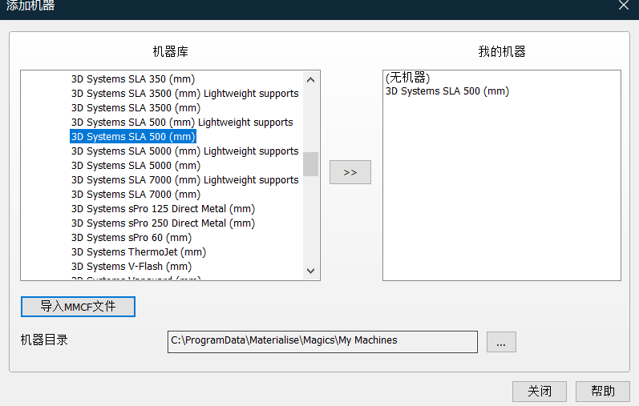

# 树脂3d打印机使用-kings

## 切片

使用magics软件进行切片，安装和破解方法参考文件

进入软件后进入机器库选择机器

这里选择mm单位的机器

这里我添加的是3d systems sla 500mm的机器，这里主要是选择可以sla的，满足打印件的大小的打印机。

添加完之后新建平台

确认之后单击右键可以加入已有的stl文件

后面的话就是摆放好位置之后，生成支撑，切片所有

注意这里要包含支撑，生成的两个文件（`.slc`, `_s.slc`）都要拷入u盘，其中一个是支撑文件。

切片内容参考网站[java stl 模型 切片_使用 Materialise magics 对 STL文件进行切片_水兰兰的博客-CSDN博客](https://blog.csdn.net/weixin_30856391/article/details/114725866?ops_request_misc=%7B%22request%5Fid%22%3A%22170108667616800211514683%22%2C%22scm%22%3A%2220140713.130102334.pc%5Fall.%22%7D&request_id=170108667616800211514683&biz_id=0&utm_medium=distribute.pc_search_result.none-task-blog-2~all~first_rank_ecpm_v1~rank_v31_ecpm-1-114725866-null-null.142^v96^pc_search_result_base5&utm_term=magics切片sla&spm=1018.2226.3001.4187)

## 打印

这里可以参考视频资料

进入打印软件，在打印之前务必要看开机的视频，有些注意事项。

然后进入控制面板，先确保**刮刀回零**，然后再**平台回零**，接着**选择L轴**，点击**L轴的回零**

注意到页面下方当L轴的数字归零后，左边的数字应在2-6之内，如果不足则加树脂，不宜超出6；

然后点击L轴旁边的**调节**，此时左边树脂的量显示会慢慢变成0，变为0之后即可开始打印

点击加载数据，然后选择刚刚切好片的两个文件，然后点击开始打印。

